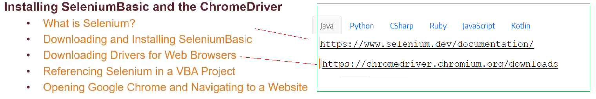
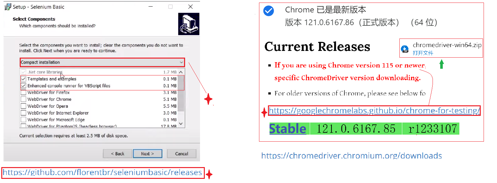
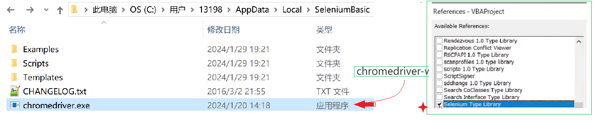
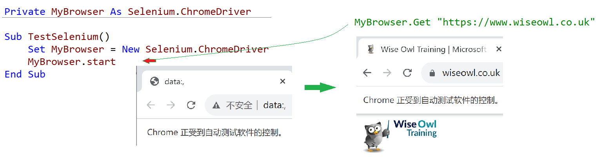

## Part 57.1 - Getting Started with Selenium Basic and Google Chrome

#### Downloading & Installing Selenium Basic  and Chrome Driver

#### Copying  Driver to the Selenium Folder & Referencing the selenium

#### Opening Google Chrome in VBA

