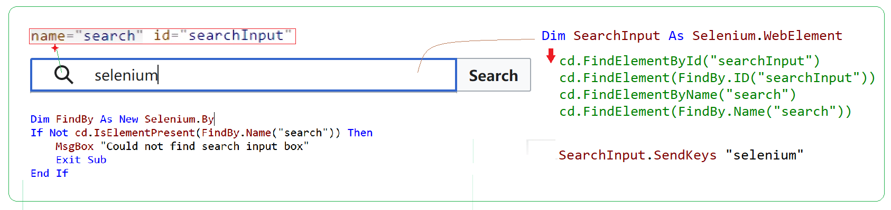
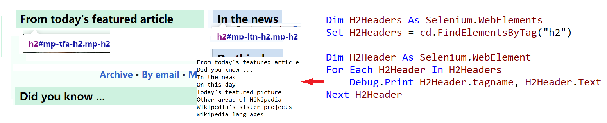
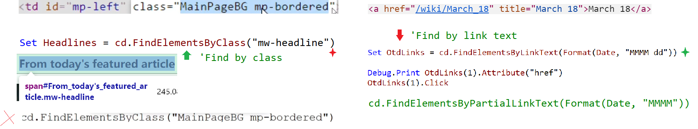

### Part 57.4 - Finding Web Elements in Selenium

##### Finding an Element by ID ...

##### Finding Elements by Tag

##### Narrowing the Scope & Further

##### Finding Elements by Class or Link text

##### Finding Elements by Css or xPath

