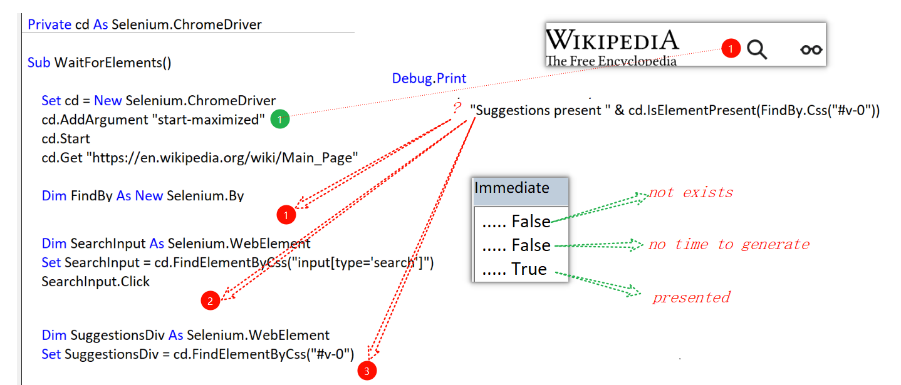
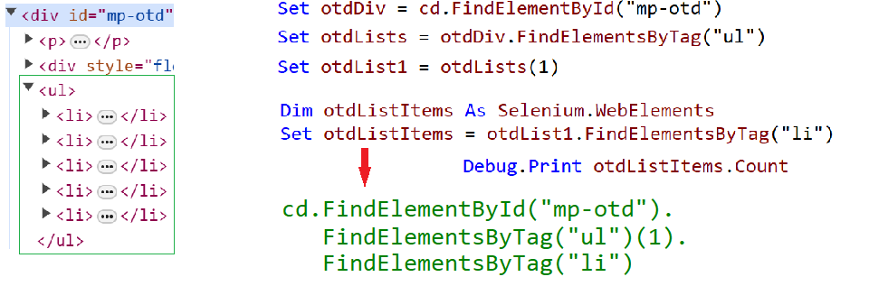
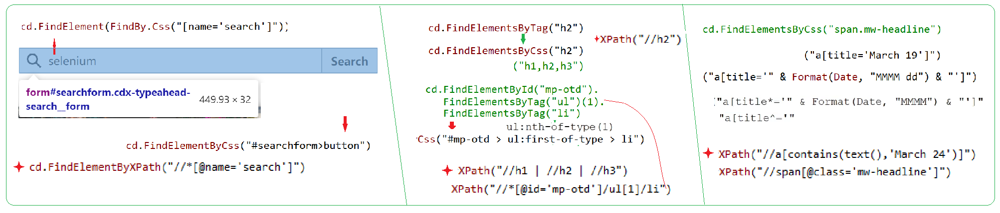

### Part 57.5 - Implicit and Explicit Waits in Selenium

#### Finding an Element by ID ...

#### Finding Elements by Tag

#### Narrowing the Scope & Further

#### Finding Elements by Class or Link text

#### Finding Elements by Css or xPath

