# Ch07 - Using Class Modules to Create Objects

[TOC]

##  Create Class Objects

- Analyze single cell:(Empty ,Label, Constant, formula)

  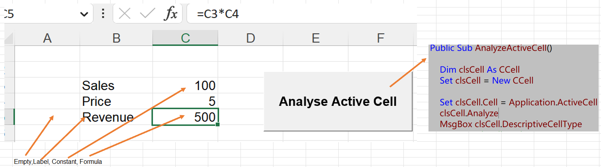

- Create the CCell:

  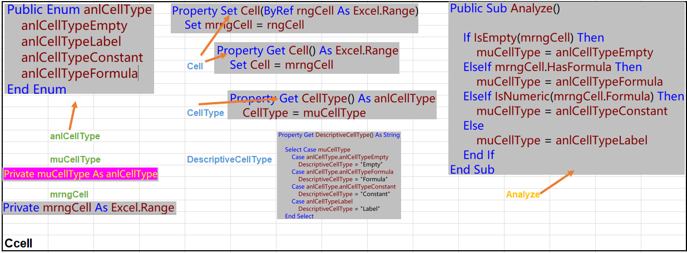

  -  public variables 

    > anlCellType muCellType mrngCell

  - Property Procedures

    > Cell CellType DescriptiveCellType

  - Methods

    > Analyze

  - The Analyze Method of the Cell Object

    > Analyze = Me.DescriptiveCellType
    >
    > MsgBox clsCell.Analyze()

##  Creating a Collection

- Using Collection to  analyze a worksheet or ranges of cells

  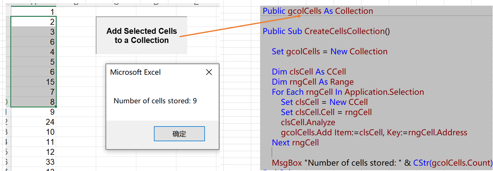

-  Access a specific Cell object

  > Set clsCell = gcolCells(3) Set clsCell = gcolCells(“$A$3”)

## Creating a CCells Object

- highlight cells of the same type and another method

  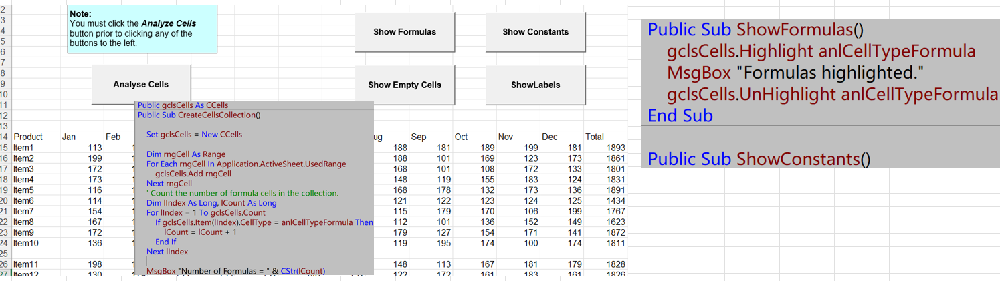

- Update the Ccell

  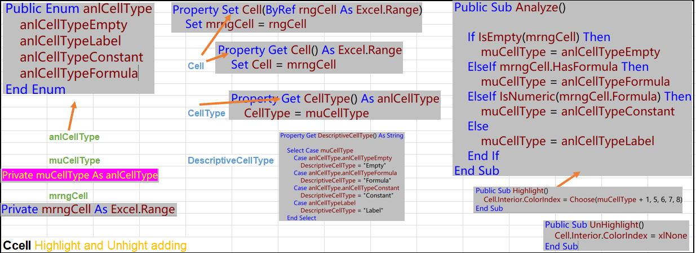

- Create the Ccells

  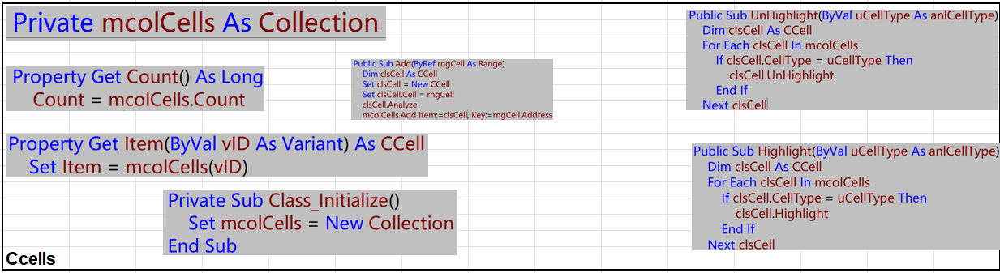

  - The two ShortComings

    - *Can not Use For...Each to process the members*
    - *has no default property: gclsCells(1) is not permitted*

  - Using a Text Editor to Solve

    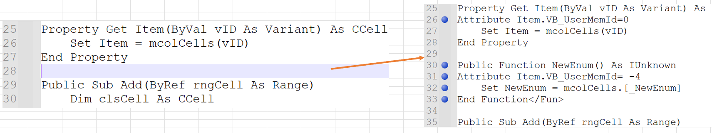

    - export Ccells - > edit -> import

      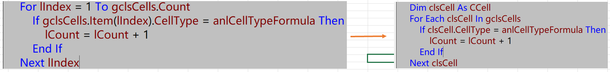

##  Trapping Events

- respond to events

  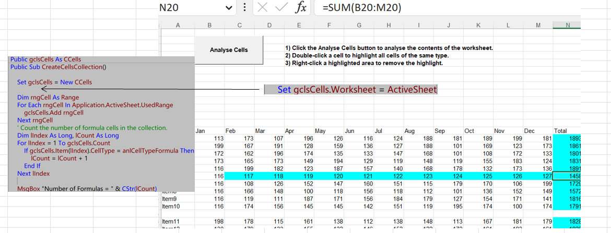

  - Declare a WithEvents variable in a class module.

    > Private WithEvents mwksWorkSheet As Excel.Worksheet

  - Assign an object reference to the variable.

  - > Property Set Worksheet(

  - Additions to the *CCells* Class Module

    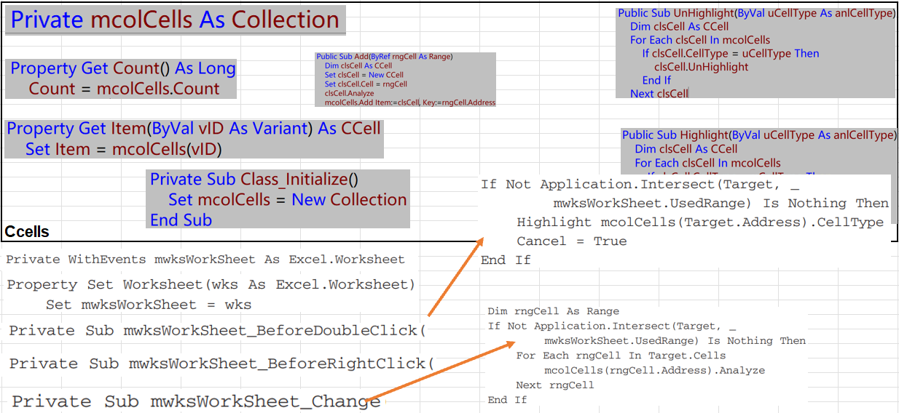

##  Raising Events

- define own events and trigger them in the code

  - The Cells raises an event that will be trapped by the Cell objects
    - An Event declaration at the top of the class module
    - A line that uses RaiseEvent to cause the event to take place

  - Changes to the CCells Class Module to Raise an Event

    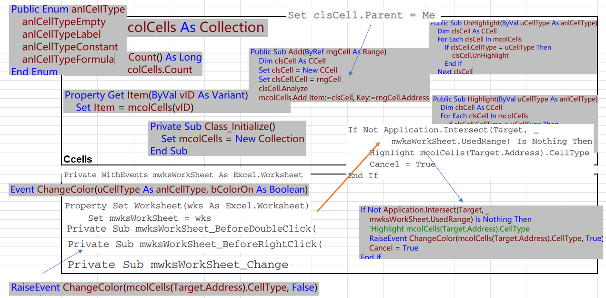

    - Move the Enum anlCellType from CCell

    - Event declaration

      ```
      Event ChangeColor(uCellType As anlCellType, bColorOn As Boolean)
      ```

    - RaiseEvent

      ```
      RaiseEvent ChangeColor(mcolCells(Target.Address).CellType, True)
      ```

    -  created an explicit parent-child relationship

      > Set clsCell.Parent = Me

  - Changes to the CCell Class Module to Trap the ChangeColor Event

    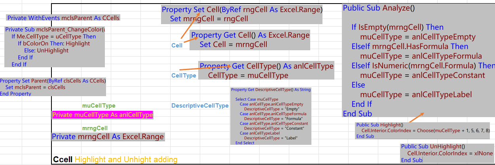

- A Family Relationship Problem

  -  multiple times creates a memory leak

    - Create the Terminate Method in CCell

      > Public Sub Terminate()
      >     Set mclsParent = Nothing
      > End Sub

  - two objects that store references to each other

    - Create the Terminate Method in CCells

      > Dim clsCell As CCell
      >     For Each clsCell In mcolCells
      >         clsCell.Terminate
      >     Next clsCell
      >     Set mcolCells = Nothing

  - Update *CreateCellsCollection* Procedure

    

## Creating a Trigger Class

- Creating a trigger class to raising the ChangeColor event 

  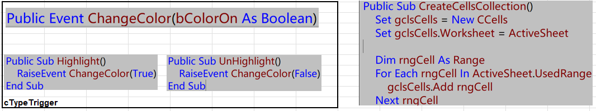

- Update the CCells & CCell (Remove Terminate ...)

- Trap the ChangeColor Event of CTypeTrigger

  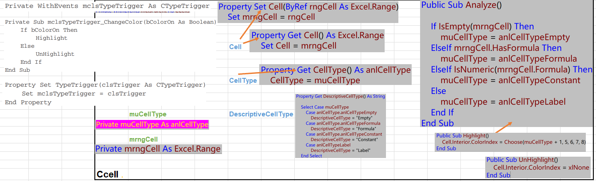

- Changes  the CCells Assign References to CTypeTrigger to Cell Objects

  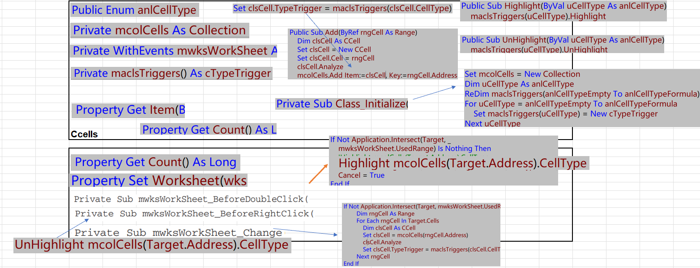

  