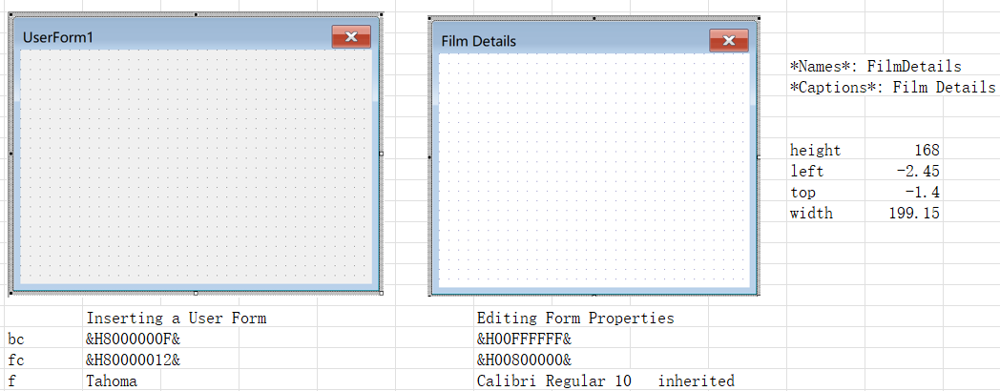
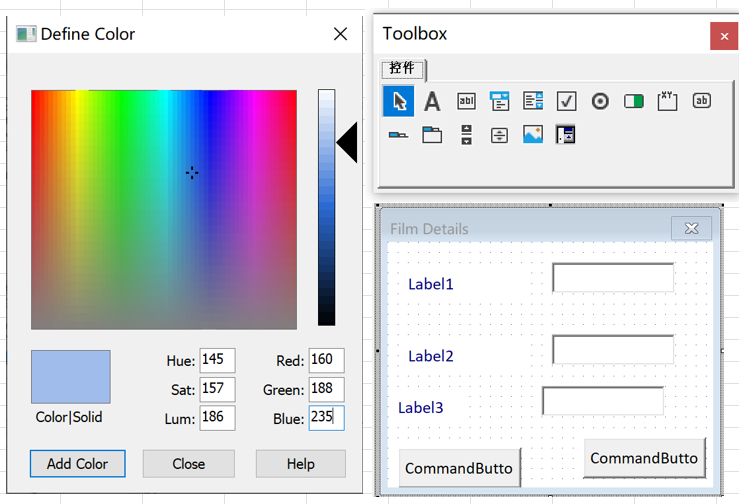
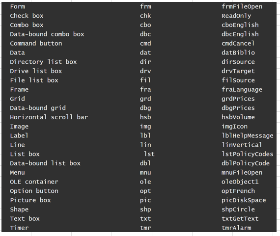
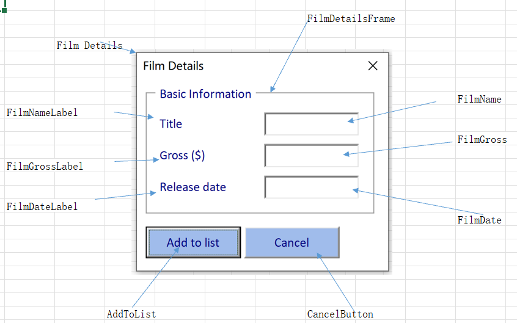

# Part 1 - Drawing Forms

[TOC]

## Drawing User Forms in Excel VBA

- Inserting a User Form

- Editing Form Properties

  - Misc
    - *Names*: FilmDetails

  - Appearance
    - *Captions*: Film Details

    - BackColor: 

    - ForeColor:
  - *Font*
    - Font: Tahoma -> Calibri Regular 10   inherited
  - Position
    - Height
    - Left
    - StartUpPosition: *1 - CenterOwner*
    - Top
    - Width

- Displaying the Toolbox

  

- Drawing Basic Controls

  - *Label*
  - *TextBox*
  - *CommandButton*

- Formatting Controls 

  - Naming Conventions for Controls

    

  - [Hungarian Notation](https://jeffpar.github.io/kbarchive/kb/173/Q173738/)

    - | Label        | TextBox      | CommandButton |
      | ------------ | ------------ | ------------- |
      | lblTitle     | txtFilmName  | cmdAddToList  |
      | lblFilmGross | txtFilmGross | cmdCancel     |
      | lblFilmDate  | txtFilmDate  |               |

      

  - Position Controls on the Form Grid

    >  [Tools -> Options -> General.*Show Grid*]

  - Selecting Multiple Controls

    > ​	[Right Click MenuBar & Choose UserForm]
    >
    > ​	Ctrl ,Shift,Click and Drag

  - Aligning Controls

    - *Lefts* , *Rights* , ...

  - Distributing Controls

    - Format -> *Vertical Spacing* -> *Make Equal*

  - Resizing Controls

    - Make Height Same Size

  - Align Middles

  - Arranging Command Buttons

    - Format -> Arrange Buttons -> Bottom

  - Grouping Controls

  Multiple Select -> *Group*

  - Framing Controls

- Running a Form: F5

  