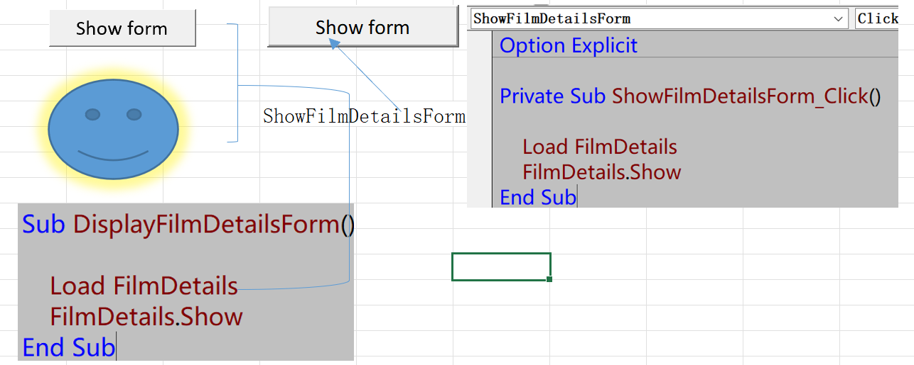
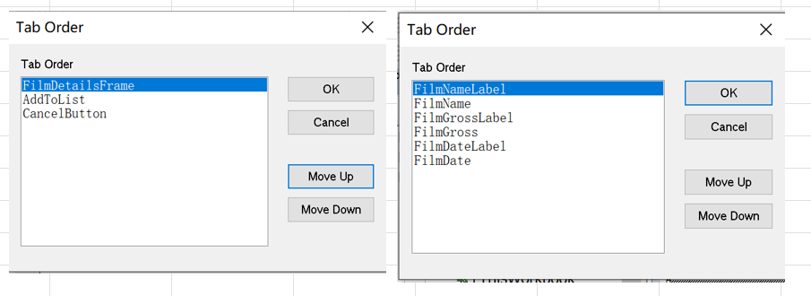
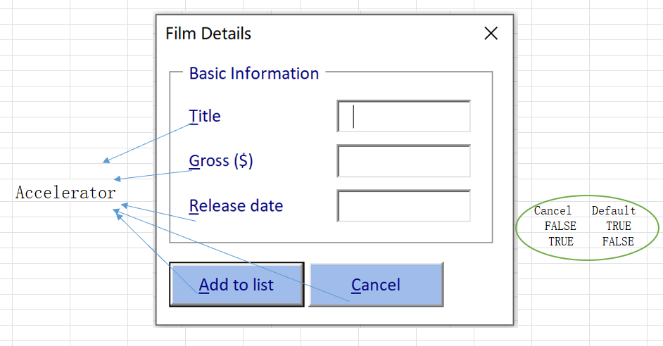

# Part 2 - Running and Navigating Forms

[TOC]

## Running User Forms in the Excel VBA

- Running a Form from the VBE
  - Setting the *Startup* Position
    - *Manual*
    - *CenterOwner*[Default]
    - *CenterScreen*
    - *Windows* Default

- Running a Form as a User

  

  - Writig Code to Run a From

    > Load FilmDetails
    >     FilmDetails.Show

  - Using a Button to Display a Form

    - Form Controls 

  - Using Drawing Object to Display a Form

    - Insert a Shape ...

  - Using ActiveX Controls

    - CommandButton

- Tabbing Through Controls

  

  - Changing the Tab Order[*TabIndex*]

    <u>V</u>iew -> *T<u>a</u>b Order* >...

  - Changing the Tab Order of *Framed* Controls

  - Removing a Control from the Tab Order

    > Misc.TabStop = false

- Assigning Accelerator Keys

  

  - Misc.Accelerator
  - *Accelerator* [Alt + key]

  - TextBox Control have no Accelerator Properties,Can Set to *Label*

- Setting a Default and Cancel Button

  > Behavior.Default Behavior.Cancel

  - *Enter* or *Esc* to Trigger Default and Cancel Property

  - When .. Activity ...

