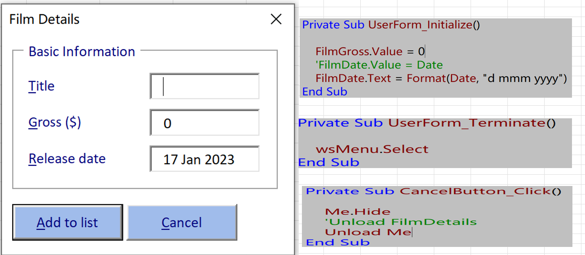
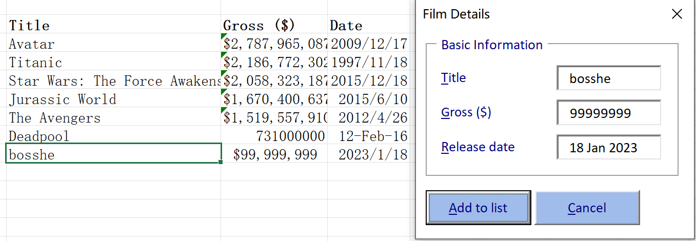

# Part 3 - Adding Code to a Form

[TOC]

## Adding Code to Forms

- The Code View

  - Setting Default Values
    - Value: any type
    - Text: string

  - Viewing the Events of a Form

    

- Referring to Forms and Controls

  - using Codenames

    > `FilmGross.Value = 0`
    > `FilmDate.Value = Date`

  - The Controls Collection

    > Controls("FilmGross").Value = 0
    > Controls("FilmDate").Value = Date
    >
    > Controls(0).Value = 0

- Control Events 

  - Initialising a Form 

    > Private Sub UserForm_Initialize()

  - Terminating a Form 

    > Private Sub *UserForm_Terminate*()

  - Hiding and Unloading a Form

    > Private Sub *CancelButton_Click*()
    
  - Writing Add to list

    

    Private Sub *AddToList_Click*()

          Me.Hide
          
          wsFilms.Select
          Range("B2").End(xlDown).Offset(1, 0).Select
          
          ActiveCell.Value = FilmName.Value
          ActiveCell.Offset(0, 1).Value = FilmGross.Value
          ActiveCell.Offset(0, 1).NumberFormat = Range("C3").NumberFormat
          ActiveCell.Offset(0, 2).Value = FilmDate.Value
          ActiveCell.Offset(0, 2).NumberFormat = Range("D3").NumberFormat
          
          MsgBox FilmName.Value & " was added to row " & ActiveCell.Row
          
          Unload Me

      End Sub

​	 