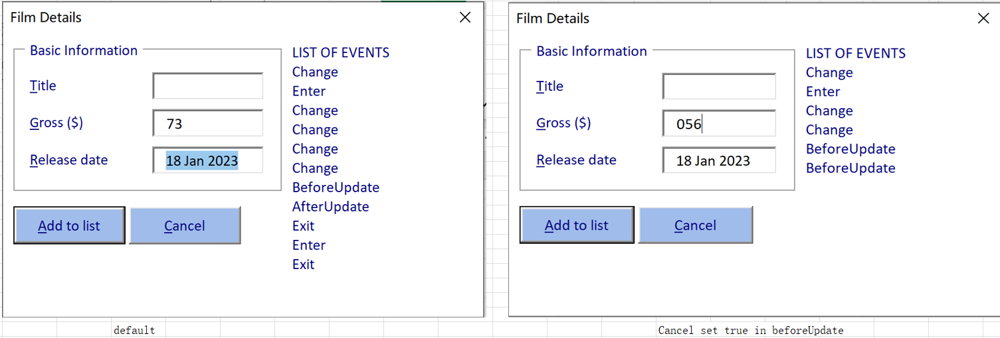
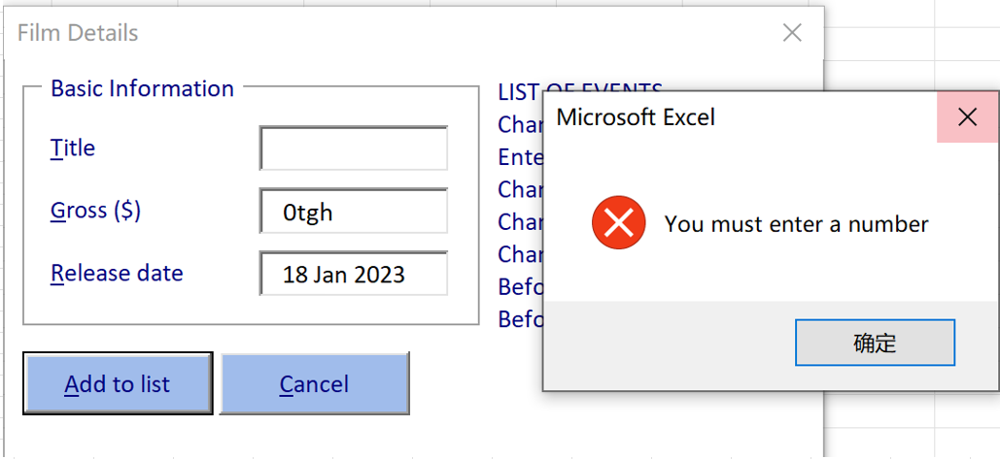
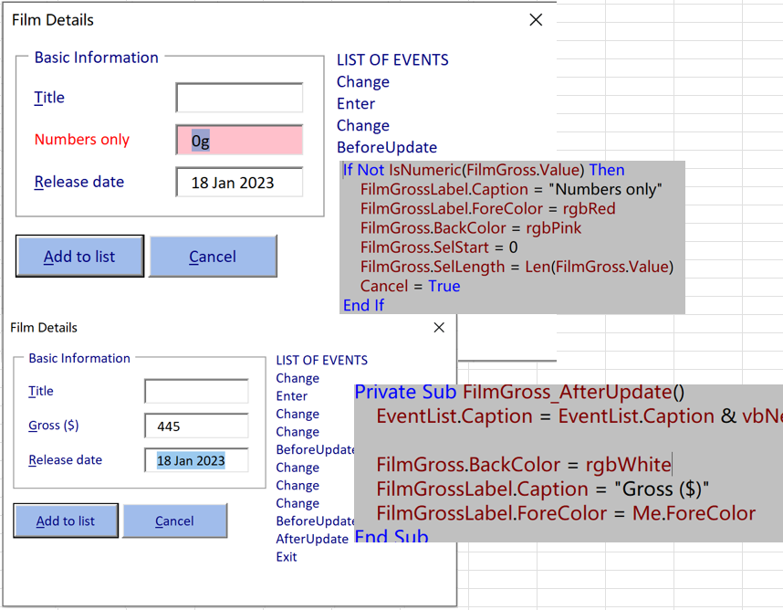
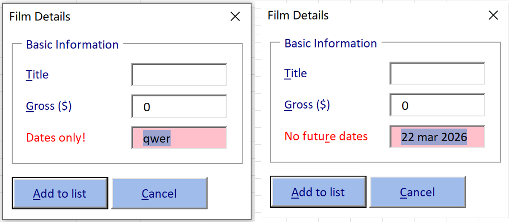

# Part 4 - Validating Controls

[TOC]


## Validating Individual Controls

- Defining Validation Rules

  - FilmGross should be a valid number

  - FilmDate is a valid date


- The Events Triggered by Entering Data

  

  - Private Sub FilmGross_Enter()

    > EventList.Caption = EventList.Caption & vbNewLine & "Enter"

  - Private Sub FilmGross_Change()

  - Private Sub FilmGross_BeforeUpdate(ByVal Cancel As MSForms.ReturnBoolean)

    > Cancel Set True will stop others

  - Private Sub FilmGross_AfterUpdate()

  - Private Sub FilmGross_Exit(ByVal Cancel As MSForms.ReturnBoolean)

- Testing for Numeric Values

  

-  Testing for Numeric Values

  > If Not IsNumeric(FilmGross.Value) Then
  > 	MsgBox "You must enter a number", vbCritical
  > 	Cancel = True
  > End If
  
- Selecting the Value in a Text Box

  `FilmGross.SelStart = 0`

  `FilmGross.SelLength = Len(FilmGross.Value)`

- Editing Label Properties at Run Time

  

- Cancelling Events

- Message Boxes vs. Formatting Controls at Run Time

- The Validation of FilmGross:

  - Private Sub *FilmGross_AfterUpdate*()


  - Private Sub *FilmGross_BeforeUpdate*(ByVal Cancel As MSForms.ReturnBoolean)

    > If Not IsNumeric(FilmGross.Value) Then
    >     Call FilmGrossShowError("Numbers only!")
    >     Cancel = True
    > Else
    >     If FilmGross.Value < 0 Then
    >         Call FilmGrossShowError("Positive numbers!")
    >         Cancel = True
    >     End If
    > End If

  - Private Sub *FilmGrossShowError*(*ErrorCaption* As String)

    > FilmGrossLabel.Caption = ErrorCaption
    >     FilmGrossLabel.ForeColor = rgbRed
    >     FilmGross.BackColor = rgbPink
    >     FilmGross.SelStart = 0
    >     FilmGross.SelLength = Len(FilmGross.Value)

- The Validation of *FilmDate*

  

  Private Sub *FilmDate_AfterUpdate*()
  
      FilmDate.BackColor = rgbWhite
      FilmDateLabel.ForeColor = Me.ForeColor
      FilmDateLabel.Caption = "Release date"

  End Sub

  Private Sub *FilmDate_BeforeUpdate*(ByVal Cancel As MSForms.ReturnBoolean)
  
      Dim ActualDate As Date
      
      If Not IsDate(FilmDate.Value) Then
          Call FilmDateShowError("Dates only!")
          Cancel = True
      Else
          ActualDate = CDate(FilmDate.Value)
          If ActualDate > Date Then
              Call FilmDateShowError("No future dates")
              Cancel = True
          End If
      End If
  
  End Sub
  
  Private Sub *FilmDateShowError*(*ErrorCaption* As String)

  
  ```
  FilmDate.BackColor = rgbPink
  FilmDateLabel.ForeColor = rgbRed
  FilmDateLabel.Caption = ErrorCaption
  FilmDate.SelStart = 0
  FilmDate.SelLength = Len(FilmDate.Value)
  ```
  
  End Sub