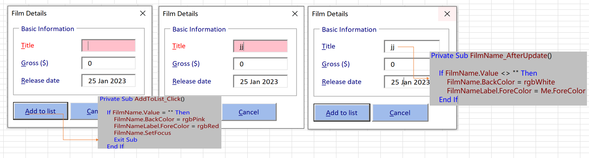
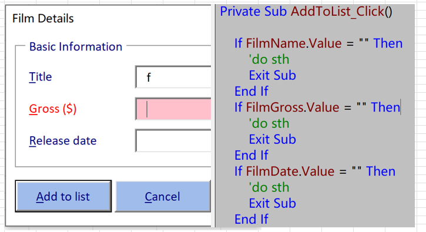
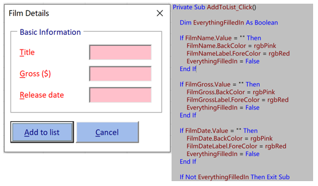
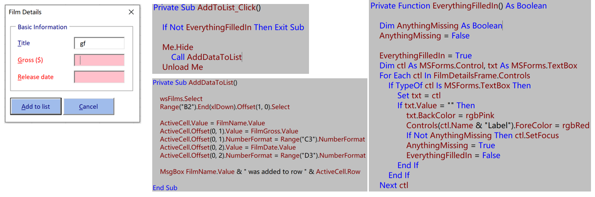

# Part 5 - Validating Forms

[TOC]

## Checking for Incomplete Forms

- Testing For Empty Controls

  

  - Choosing the Correct Event

  - Testing if a Text Box is Empty 

  - Setting the Focus to a Control

  - Resetting the Formatting of a Control

- Checking Multiple Controls

  - Checking Controls Individually

    

    - each text box is checked One by one not whole

  - Highlighting Every Control in One Pass 

    

    

    


  - Tidying Up the Click Event Handler

    - *AddDataToList* Sub

    - Creating a Function for Validation

      Private Function *EverythingFilledIn*() As Boolean

      ```
      EverythingFilledIn = True
      
      If FilmName.Value = "" Then
          FilmName.BackColor = rgbPink
          FilmNameLabel.ForeColor = rgbRed
          EverythingFilledIn = False
      End If
      
      If FilmGross.Value = "" Then
          FilmGross.BackColor = rgbPink
          FilmGrossLabel.ForeColor = rgbRed
          EverythingFilledIn = False
      End If
      
      If FilmDate.Value = "" Then
          FilmDate.BackColor = rgbPink
          FilmDateLabel.ForeColor = rgbRed
          EverythingFilledIn = False
      End If
      ```

      End Function

    - *AddToList_Click* Sub

- MsForms.Controls

  

  - Looping Over Controls

    > Dim ctl As MSForms.Control
    >     For Each ctl In Me.Controls
    >         Debug.Print ctl.Name
    >     Next ctl

  - Testing the Control's Type

    > If TypeOf ctl Is MSForms.TextBox

  - Checking for empty controls

    > If ctl.Value = "" Then
    >      ctl.BackColor = rgbPink
    >       EverythingFilledIn = False
    > End If

  - Referring to the Correct Type of Control using intelegent

    > txt As MSForms.TextBox

  - Referring to the Associated Label

    > Controls(ctl.Name & "Label").ForeColor = rgbRed

  - Setting the Focus in a Loop

