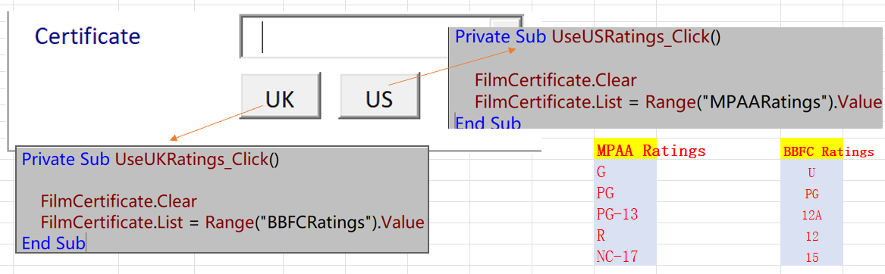

# Creating Drop Down Lists

[TOC]

## Drawing and Formatting ComboBoxes

- FilmCertificate

  - Populating a Combo Box

    

    1. Using a Static List:    Lists!A2:A7

    2. Referring to Range Names: BBFCRatings

    3. Retrieving the Value of a Combo Box

       

    4. Retrieving the Choices in a Combo Box

       - The *MatchRequired* Property: false - > true
       - *Style* Property:  2 - *fmStyleDropDownList* (0 default)

    5. Resetting the Formatting of a Combo Box

    6. Changing the Button and List Style:    *DropButtonStyle* & *ListStyle*

  - Using a Combo Box on a Form

  - Validating a Combo Box

    

    > Private Function *EverythingFilledIn*() As Boolean
    >

## Alternatives to the Row Source

- Setting the List Property

  - Row Source Property

    > FilmCertificate.RowSource = "BBFCRatings"

  - List Property in *UserForm_Initialize*
  
    > FilmCertificate.List = Range("BBFCRatings").Value
    >
    > RELATIVE : |
    >
    > = wsLists.Range("A2", wsLists.Range("A2").End(xlDown).Value
  
- The AddItem Method

  P*rivate Sub PopulateCertificates()*

  > With FilmCertificate
  >     .AddItem "U"
  >     .AddItem "PG"
  >     .AddItem "12A"
  >     .AddItem "12"
  >     .AddItem "15"
  >     .AddItem "18"
  > End With

- Clearing and Resetting a List

  

## Setting Up a Multi-Column Combo Box 

- Name Range Updated

  

- Setting the Multi-Column List

  

- Working with Multi-Column Properties

  

  - *ColumnCount*

  - *ColumnWidth* [pt, cm, in]

  - *BoundColumn*

  - *TextColumn*

    > ActiveCell.Offset(0, 4).Value = *FilmCertificate*.Text
    >
    
    - Problems with TextColumn set 2:
    
      
    
      - Show Description not certificate in the form
      - Validation is not work [return null or none not empty]
    
  - Referring to Columns by Index Number: 0 refer to first column
  
    `ActiveCell.Offset(0, 4).Value = FilmCertificate.Column(1)`   
  
  - *AddDataToList* subroutine updated
  
    > ActiveCell.Offset(0, 4).Value = FilmCertificate.Column(1, FilmCertificate.ListIndex)