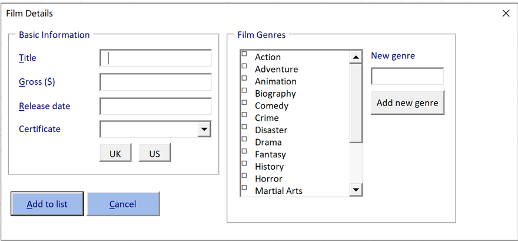
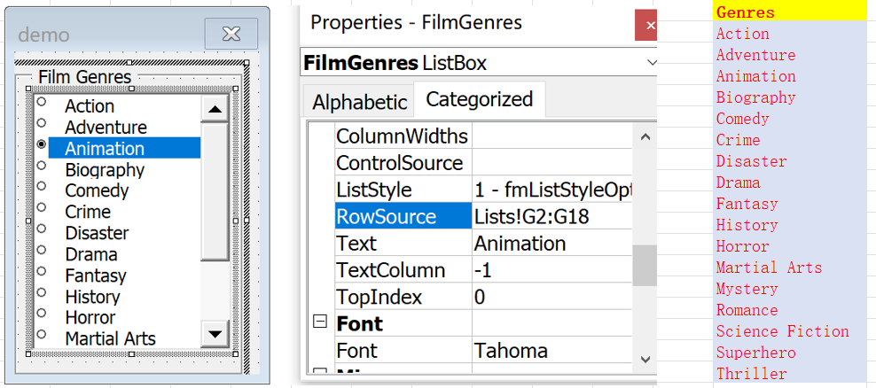
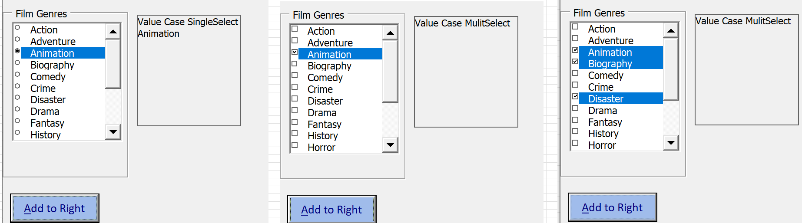
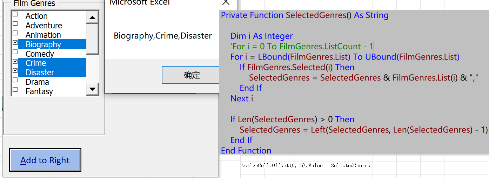
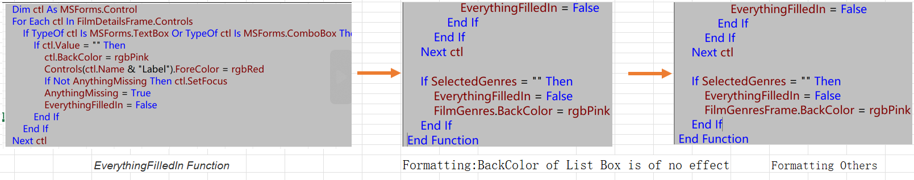
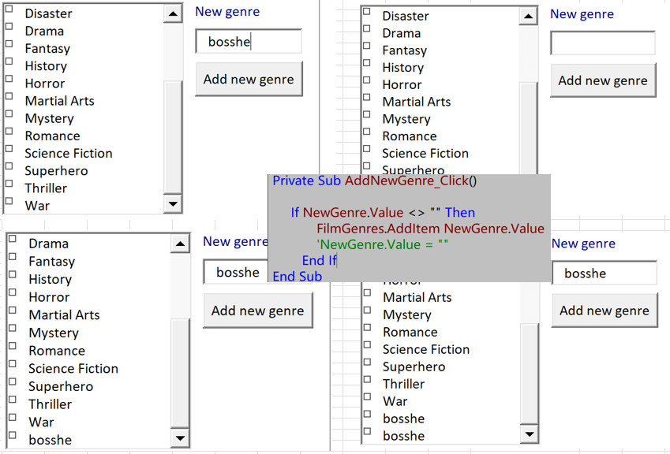
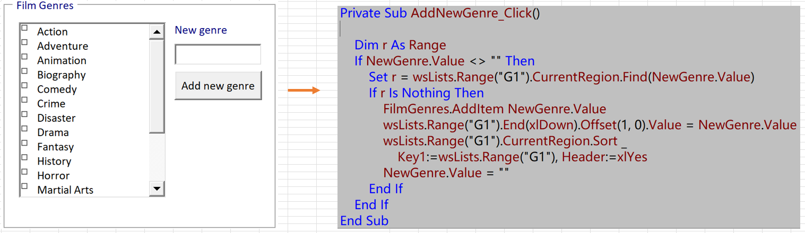

# Creating List Boxes

[TOC]

## Drawing and Formatting ListBoxes

- Drawing *FilmGenresFrame* 
- Drawing *FilmGenres*

## Populating the List

- Alternatives to the Row Source

  

  - Using the RowSource: *Lists!G2:G18* [*Can not update in run time*]

  - ListStyle: *frmListStyleOption*

- Setting the List Property in UserForm_Initialize

  > FilmGenres.List = wsLists.Range("G2", wsLists.Range("G1").End(xlDown)).Value
## Referring to the Selected Item

- Basic Reference [*fmMultiSelectSingle*]

  `ActiveCell.Offset(0, 5).Value = FilmGenres.Value`

- Allowing Multiple Items to be Selected: 

  - *fmMultiSelectSingle*

  - *fmMultiSelectMulti*

  - *fmMultiSelectExtended* can hold shift to multiselect

- Referring to the Value of a Multi-Select List Box

  - When Multi-Select *FilmGenres*.*Value* return no value

    

  - Declaring a Function
  
    
  

## Validating the List Box

- Basic Formatting [Formatting *BackColor of List Box in spec event is of no effect*]

  > If SelectedGenres = "" Then
  >         EverythingFilledIn = False
  >         FilmGenres.BackColor = rgbPink
  >     End If

- Formatting Other Conrols:

  
  
  > Private Sub *FilmGenres_Change*()
  >     `FilmGenresFrame.BackColor = rgbWhite`
  > End Sub

## Adding Items to the List Box at Run Time

- Primary first ver

  

  
  
  - Problem:
  
    - *New Genre will Disappear when Reopen*
  
    - *Duplicate repeated*
  
- *Adding Items to a Worksheet

  
