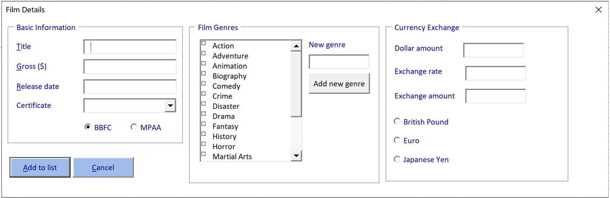
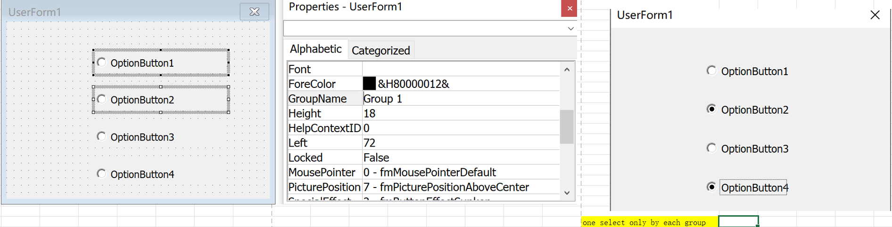
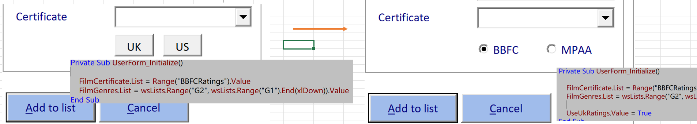
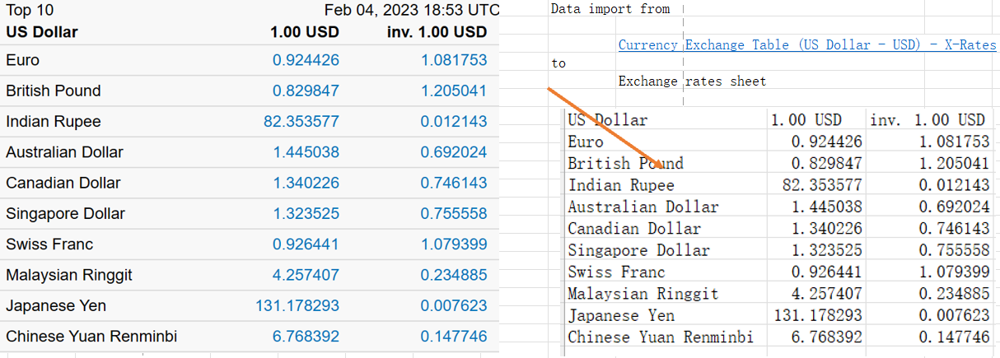
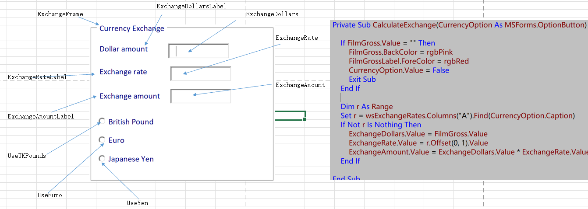
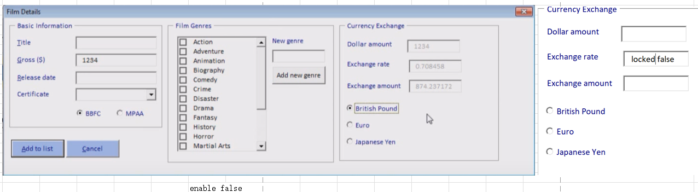

# Creating Option Buttons

[TOC]

## Drawing Option Buttons

## Grouping and Formatting Options

- *New Drew Option Belong to Default Group*
- *only one can select each group* 
- *Using Frames can Group Options*

## The Basic Example

- Replace UK & US cmd Button with Option Buttons use exact names

- *Setting the Value of an Option Button 

  

  

## A More Complex Example

- Setting Up a Web Query:

  

  *from*-"https://www.x-rates.com/table/?from=USD&amount=1" 

- Drawing the Controls & Creating a Calculate  Procedure 

  

- Creating the Click Event Handlers

  - *Passing the Option to the Procedure

    Private Sub *UseEuro_Click*()
        `Call CalculateExchange(UseEuro)`
    End Sub
  
    Private Sub *UseUKPounds_Click*()
        `Call CalculateExchange(UseUKPounds)`
    End Sub
  
    Private Sub *UseYen_Click*()
        `Call CalculateExchange(UseYen)`
    End Sub
  
  - *Enable* & *Locked* property in Text Box 
  
    

