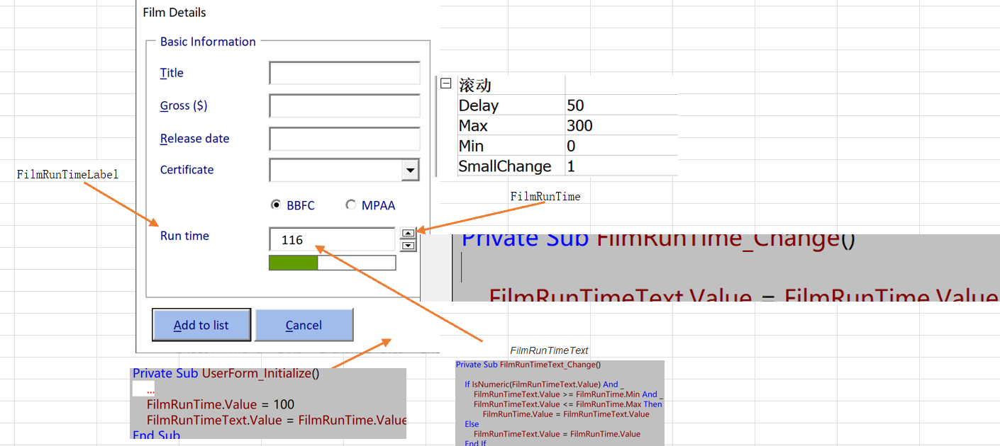
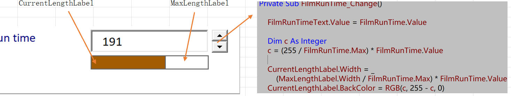

# Creating Spin Buttons

[TOC]

## Drawing Spin Buttons

- Displaying the Value of a Spin Button

  Private Sub *FilmRunTime_Change*()

  ​	`FilmRunTimeText.Value = FilmRunTime.Value`

  End Sub

- Basic Spin Button Properties

  - Setting a Minimun, Maximum Value

  - *Setting the Default Value
  
    > Private Sub *UserForm_Initialize*()
    >
    
  - Non-Synchronised Text Boxes

    - Locking and Disabling Text Boxes

    - *Synchronising a Text Box with Spin Button
  
      > Private Sub *FilmRunTimeText_Change*()
  >

## Using the Value of Spin Button

*Private Sub *AddDataToList*()

>  ActiveCell.Offset(0, 6).Value = FilmRunTime.Value

- The Spin Up and Spin Down Events

## A More Interesting Example

- Drawing the Extra Controls

  - MaxLengthLabel
    - *BorderStyle*
  - CurrentLengthLabel
    - *BorderStyle*
    - *BackColor*

- Calculating the Width of a Label

  *CurrentLengthLabel*.Width = _
          (*MaxLengthLabel*.Width / *FilmRunTime*.Max) * *FilmRunTime*.Value

- *The RGB Function

  