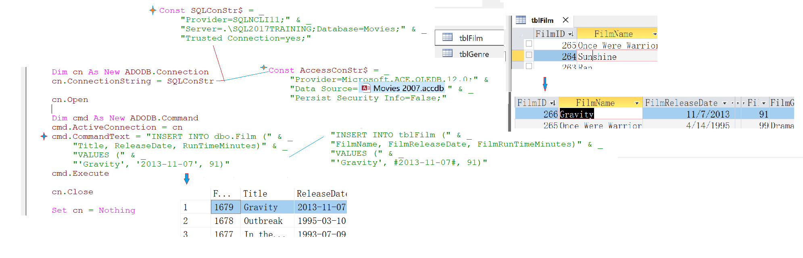
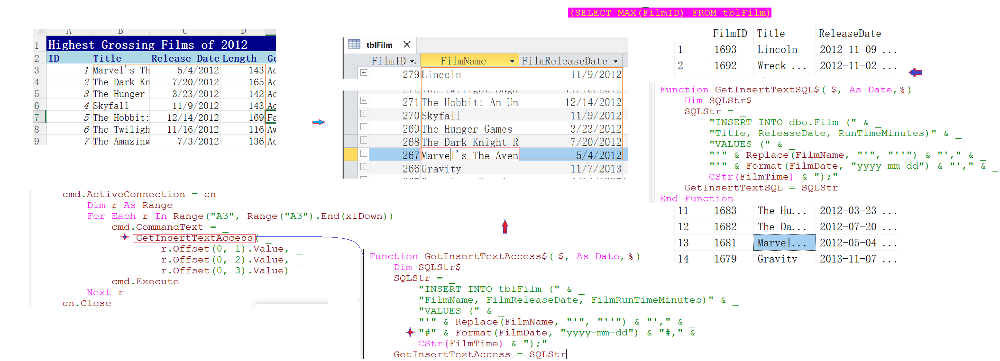
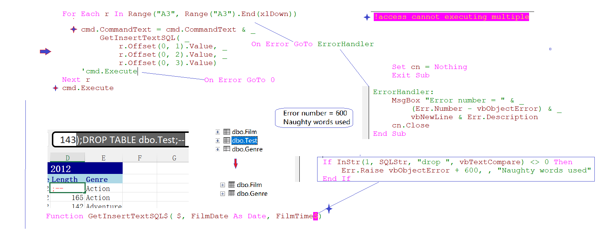
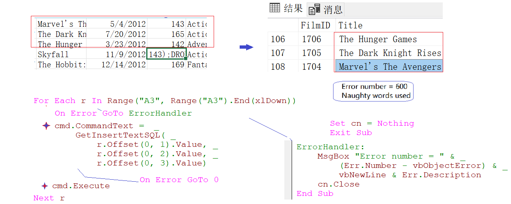
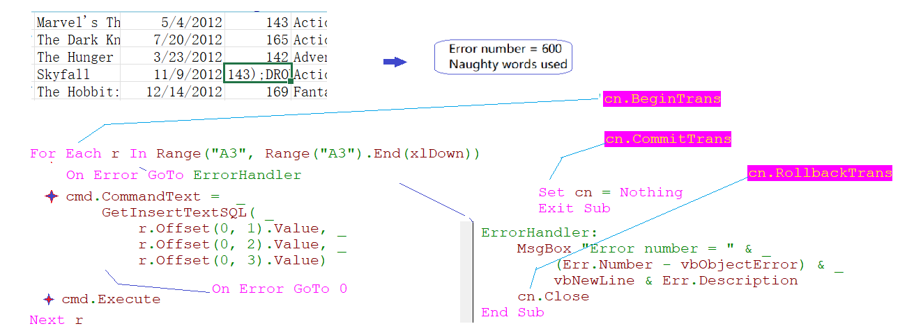
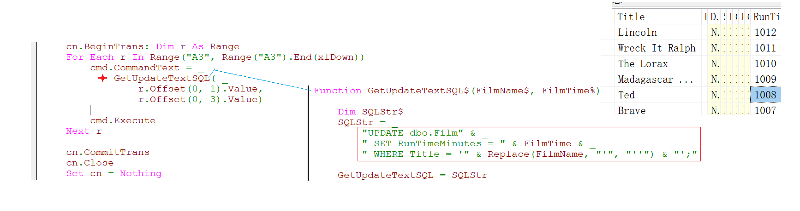
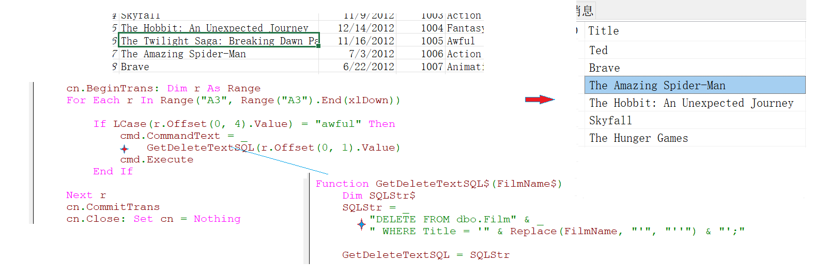

###  Part 32 - ADO SQL Statements (INSERT, UPDATE, DELETE)

- Basic insert statement(sql & access)

  

- Insert Excel cells 

  
  
- Executing multiple statements & dealing with dynamic sql risk

  
  
- Begin, Commit, Rollback Transactions

  - default without trans
  
    
  
  - Using trans(no records added )
  
    
  
    
  
- UPDATE statements

  

- DELETE statements

  

