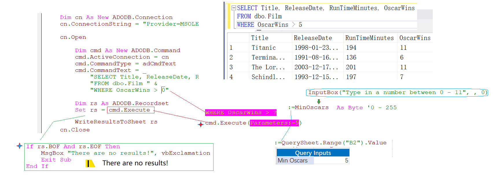
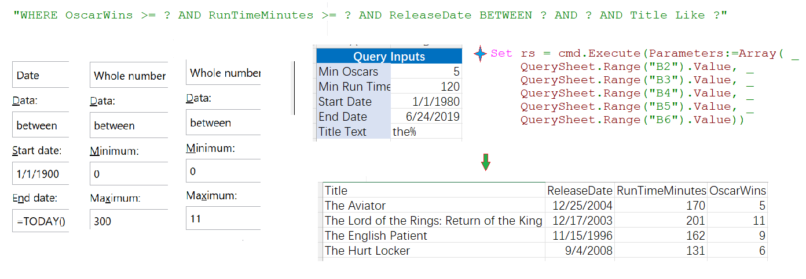
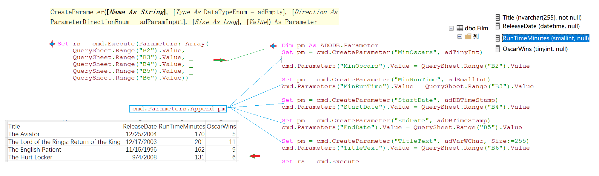
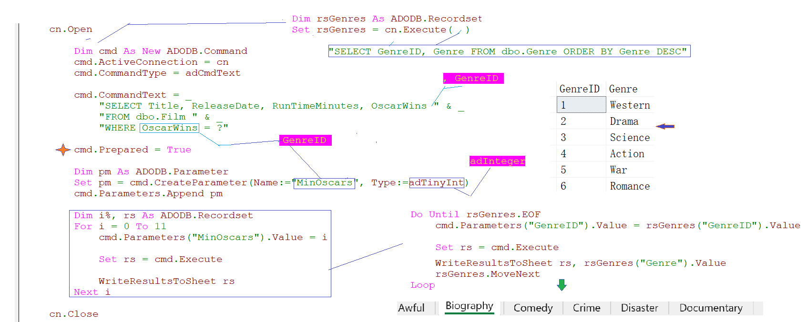

### Part 56.6 - ADO Commands and Parameters

- Parameterising an SQL Statement 

  

- Mapping multiple Values to Parameters

  

- Parameters objects and datatypes

  

  >   https://www.w3schools.com/asp/ado_datatypes.asp

- Reusing parameter in a  loop

  