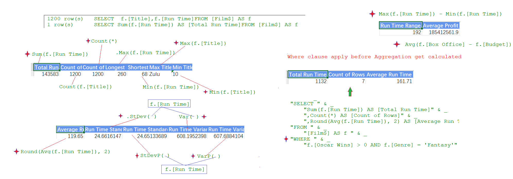

### Part 58.12 - SQL for Excel Files - Aggregation Functions

- Aggregation Functions in SQL(count ,sum , round , min ,max, avg)

  

- Dealing with Nulls

  - Aggregating ignore the Nulls thus Count(f.[Title]) may > Count(f.[Budget])

  - Desc

    > "SELECT " & _
    >             "Count(**) AS [Count of Rows]" & _
    >             ",Count(f.[Budget]) AS [Count of Budgets]" & _
    >             ",Avg(f.[Budget]) AS [Average of Budgets]" & _
    >             ",Sum(f.[Budget]) / Count(f.[Budget]) AS [Average of Budgets 2]" & _
    >             ",Sum(f.[Budget]) / Count(*) AS [Average of Budgets 3]"  & _
    >
    > " FROM [Film$] AS [f]"

  - Replacing Nulls With a value

    > Avg(IIf(IsNull(f.[Budget]), 0, f.[Budget])) AS [Average of Budgets 4]

  - Result

    | Count of  Rows | Count of Budgets | Average of Budgets | Average of Budgets 2 | Average of Budgets 3 | Average of Budgets 4 |
    | -------------- | ---------------- | ------------------ | -------------------- | -------------------- | -------------------- |
    | 1200           | 1076             | 54999235.76        | 54999235.76          | 49315981.4           | 49315981.4           |

  - Filtering Out Nulls

    > WHERE " & _
    >             "f.[Budget] IS NOT NULL AND f.[Box Office] IS NOT NULL"

    | Count of  Rows | Count of Budgets | Average of Budgets | Average of Budgets 2 | Average of Budgets 3 | Average of Budgets 4 |
    | -------------- | ---------------- | ------------------ | -------------------- | -------------------- | -------------------- |
    | 1046           | 1046             | 56265933.72        | 56265933.72          | 56265933.72          | 56265933.72          |
