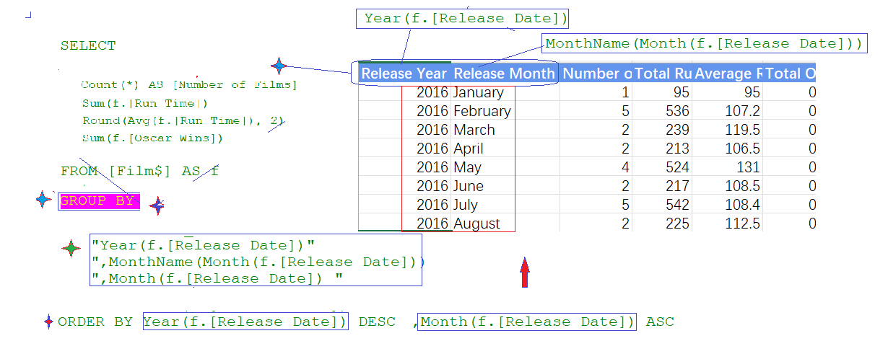

### Part 58.13 - SQL for Excel Files - Grouping Rows

- Basic Use of Group By 

  

- Sorting & Where in Aggregated Values  

  

- Grouping on Multiple Fields & Calculations

  

- Grouping & sorting by Year

  

- Group & Sorting by Month Number

  

