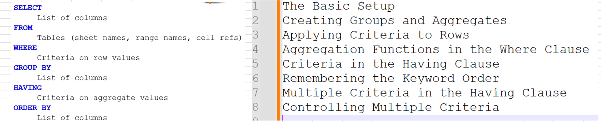
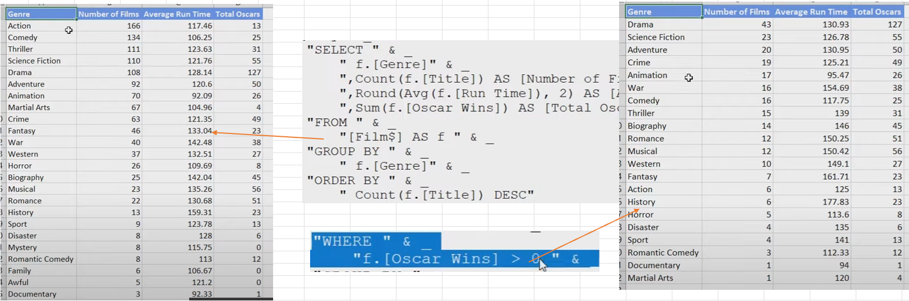
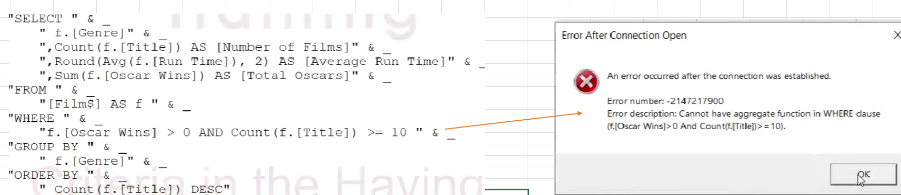
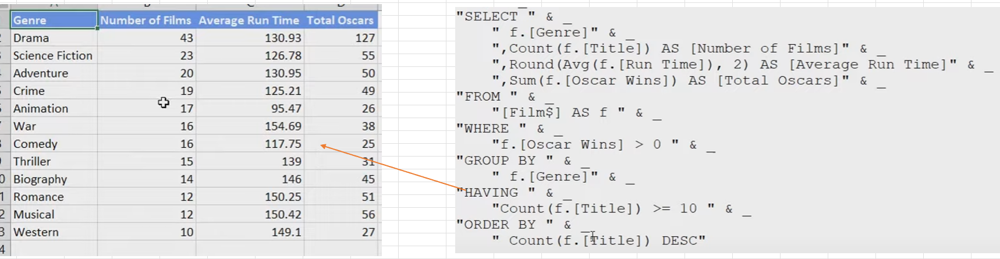
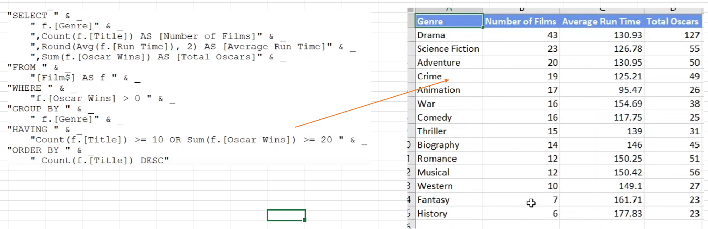

## Part 58.14 - SQL for Excel Files - Criteria in the Having Clause

#### Creating Groups and Aggregates

#### Aggregation Functions in the Where Clause

> WHERE [Oscar Wins] > 0 AND Count([Title]) >= 10  - > SYNTAX ERROR !!!!

#### Criteria in the Having Clause

> HAVING Count([Title]) >= 10 

#### Multiple Criteria in the Having Clause

#### Controlling Multiple Criteria

> "HAVING  (Count([f.Title]) >= 10 OR Sum(f.[Oscar Wins] >= 20)) AND Avg(f.[Run Time]) >= 150 
