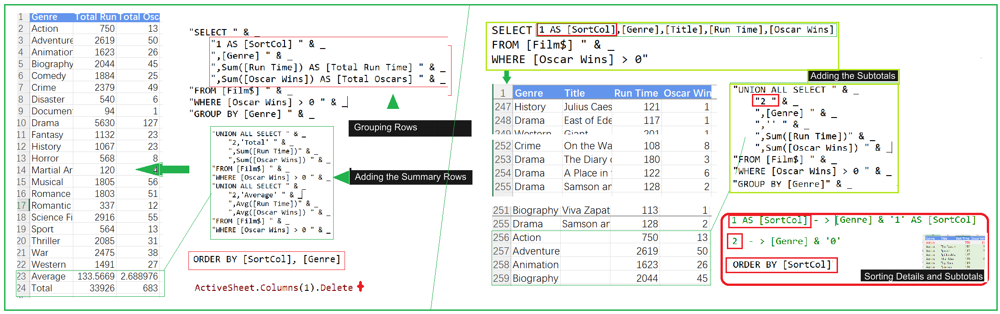

## Part 58.17 - SQL for Excel Files - Union Queries with Total Rows

#### Creating Summary Row & Adding Criteria 

#### Sorting with Summary Row

#### Sort With Grouping Rows[Subtotal] ...

####  Improving the Appearance of the Results

#### Mergining & Adding Grand Ttl

