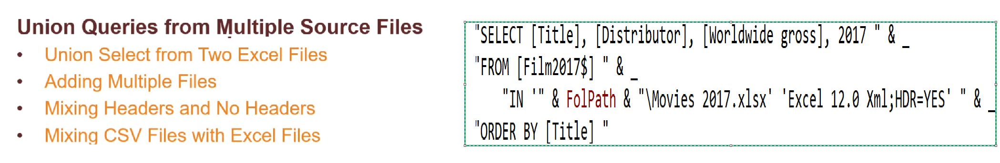
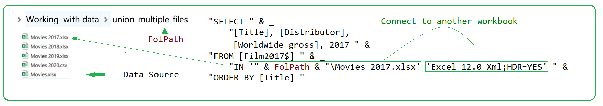
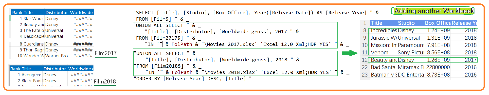
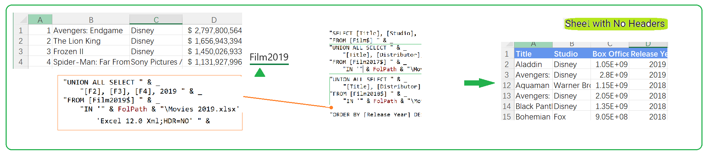
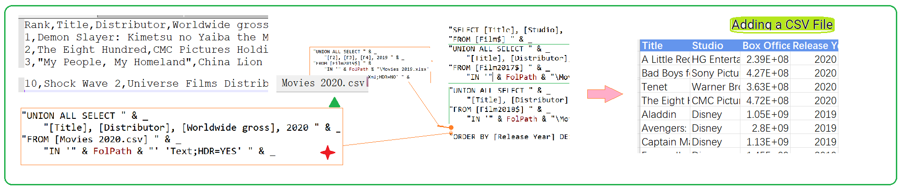

## Part 58.18 - SQL for Excel Files - Union Queries from Multiple Files

#### Connect to another source

#### Adding another workbook 

#### Adding Sheet with no Headers

#### Adding the CSV file

