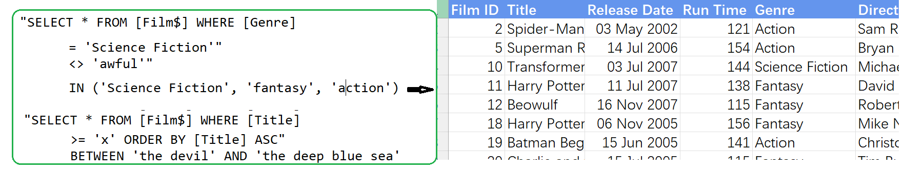
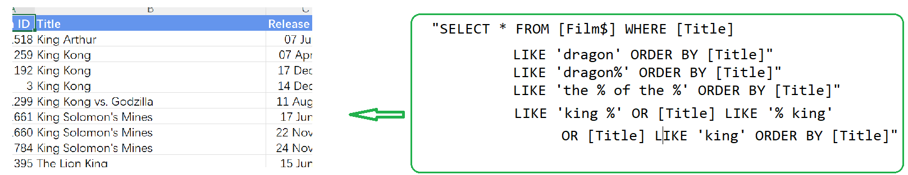
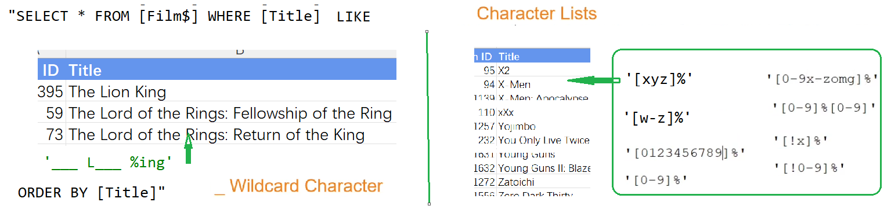
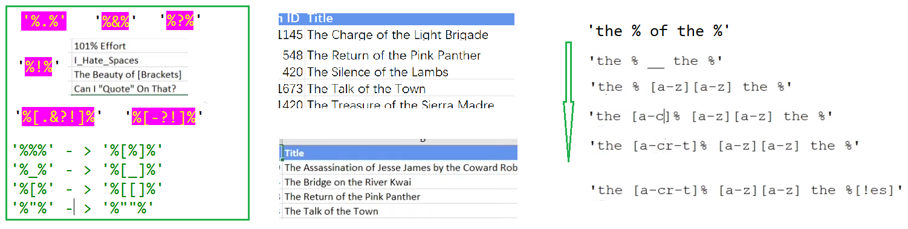

## Part 58.18 - SQL for Excel Files - Union Queries from Multiple Files

#### Basic Criteria

#### The LIKE and % operator

#### _ and Character lists

#### Punctuation ,Exclamation Marks ...

#### Using Function in Criteria

