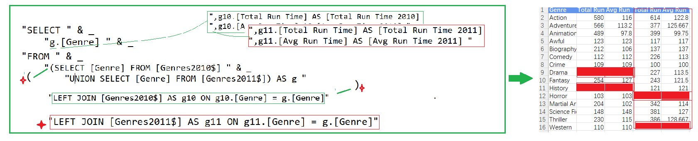

## Part 58.23 - SQL for Excel Files - Merge Worksheets Side by Side

#### Join two worksheets

#### Creating the derived table with Uniqe List 

#### Joining to the derived table subquery

#### Joining another

#### Jorn more sheets

