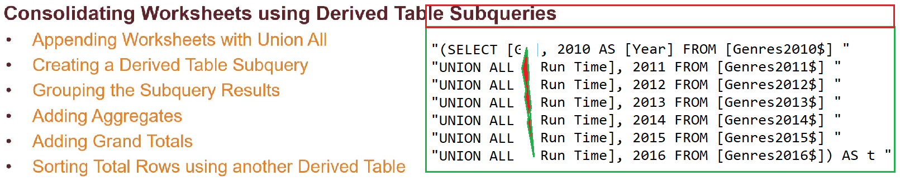
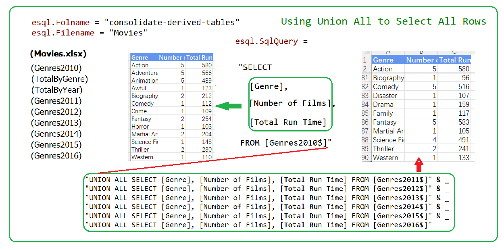
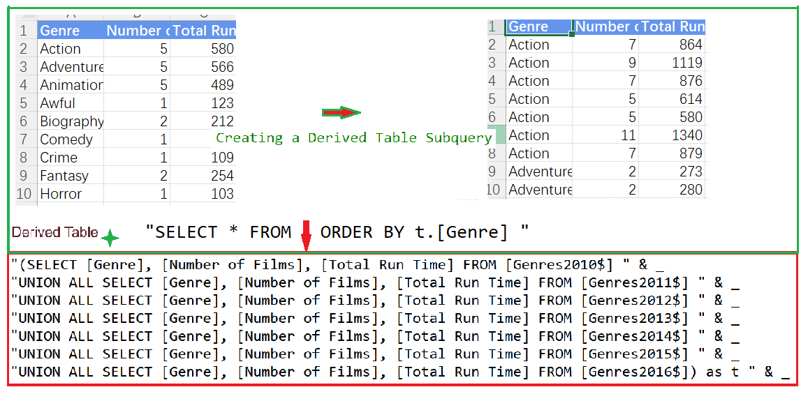
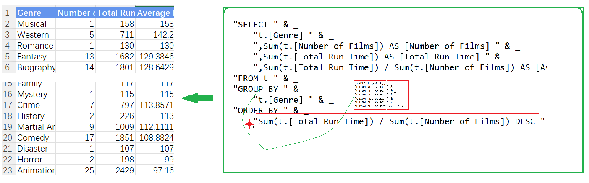
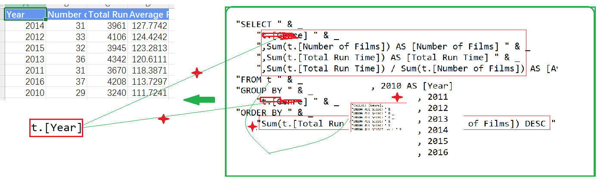
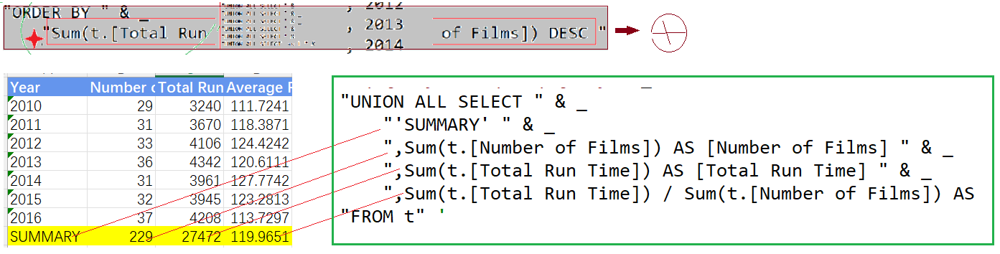
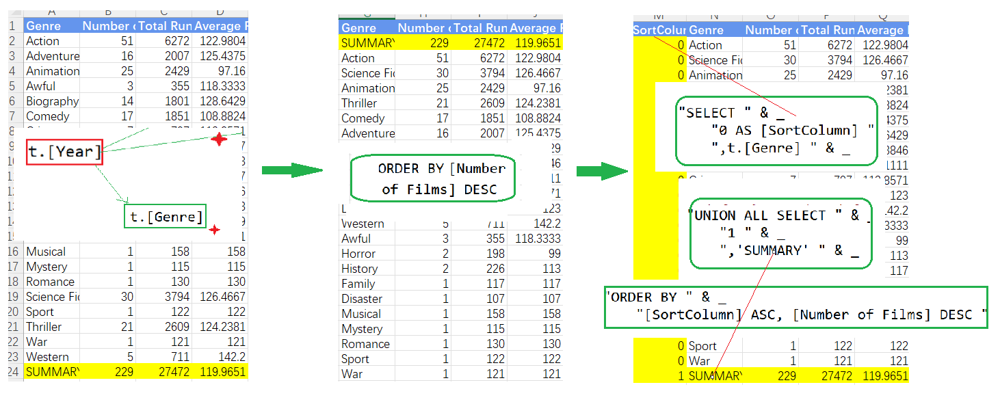
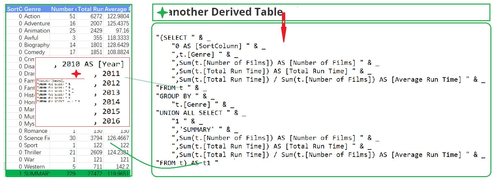
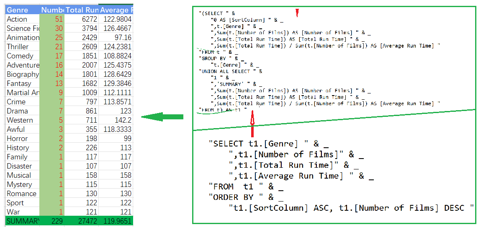

## Part 58.24 - SQL for Excel Files - Consolidate Worksheets with Derived Tables

#### Using Union All 

#### The Derived Table Subquery

#### Adding Group with multi Calculation

#### Grouping by the Source Worksheet(with t changed)

#### Adding a Summary Row

#### Changing the Grouping & Sorting

#### Creating another Derived table

#### Using the another Derived table to remove header

