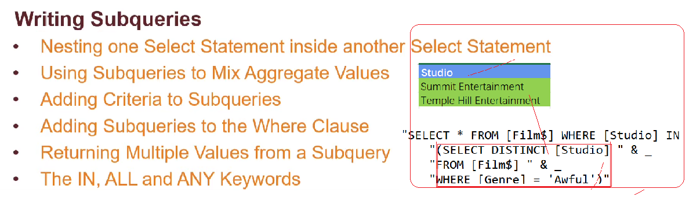
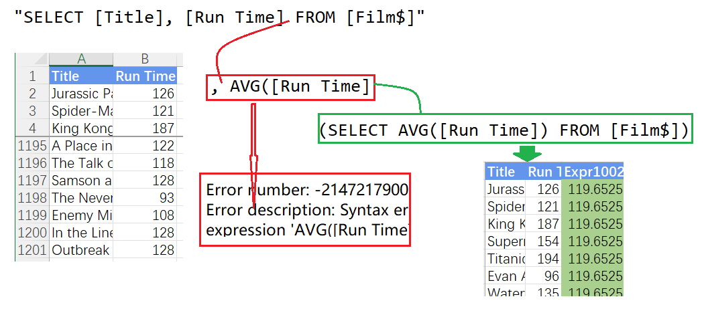
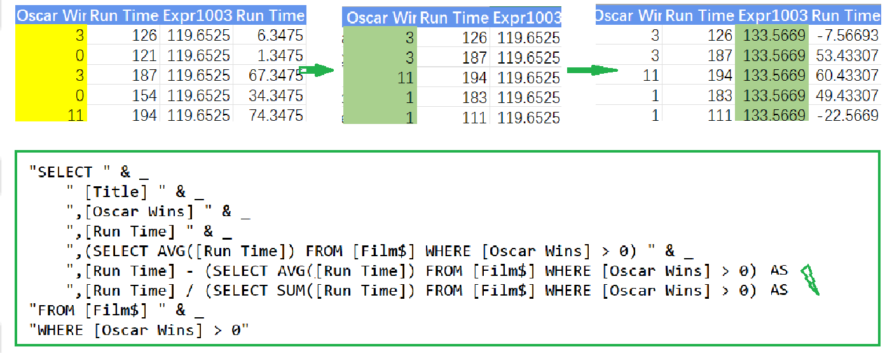
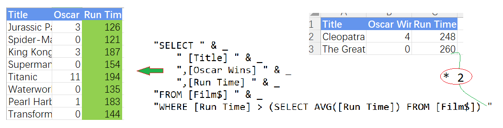
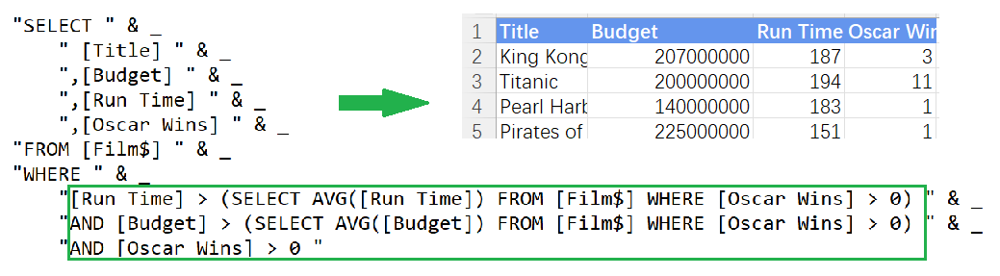
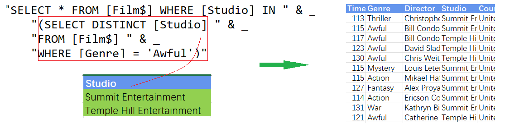
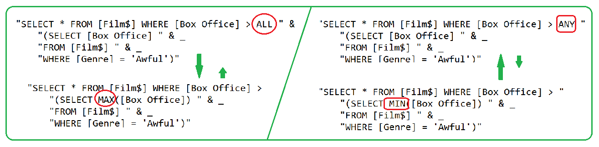

## Part 58.25 - SQL for Excel Files - Basic Subqueries

#### Calculation in a Subquery

#### Criteria in Subqueries

#### Subqueries in Criteria

#### Multiple Subqueries in the Where Clause

#### Returning Multiple Values from a Subquery

#### Using the ALL & ANY Keyword

