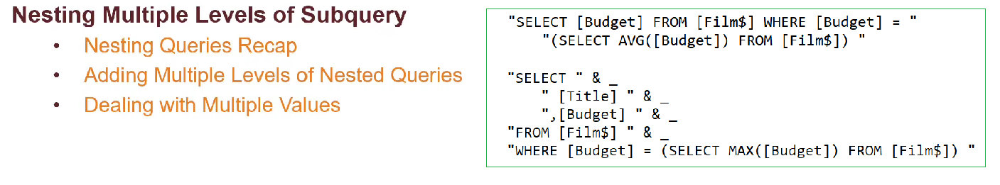
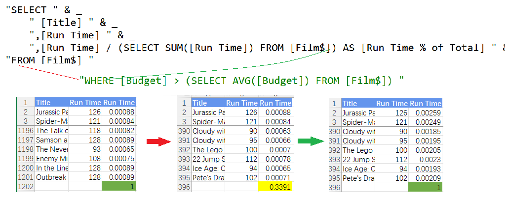
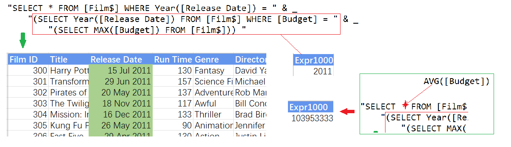
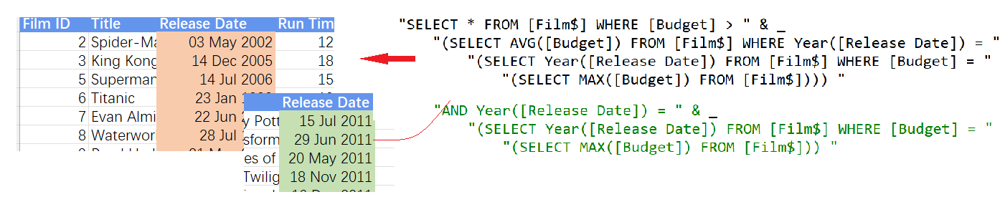
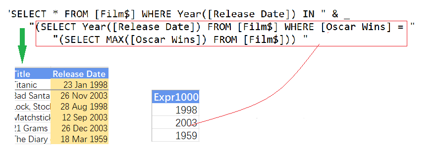

## Part 58.26 - SQL for Excel Files - Nested Subqueries

#### A Reminder of Basic Subqueries

#### Changing Exam & Nesting Queries to Three Levels

#### Nesting to Four Levels & Adding Criteria

#### Using IN  Multiple Values from a Subquery

