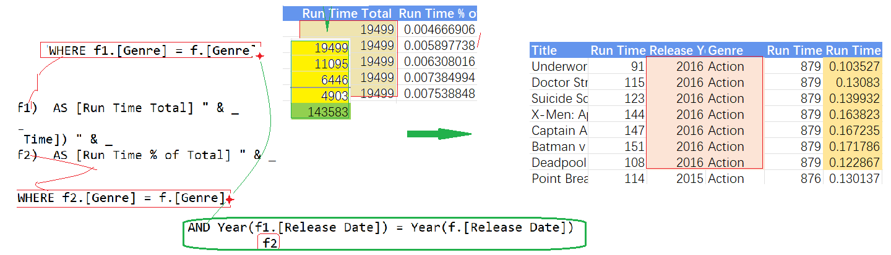

## Part 58.27 - SQL for Excel Files - Correlated Subqueries

#### Creating a Correlated Subquery

#### Adding More Criteria to a Correlated Subquery

#### Converting to a Correlated Subquery

#### Returning Multiple Values from a Subquery

#### Ranking (Group) Values

#### Calculating a Running Total Column

#### Year to Date Calculation

