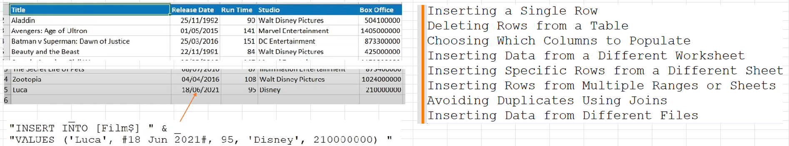
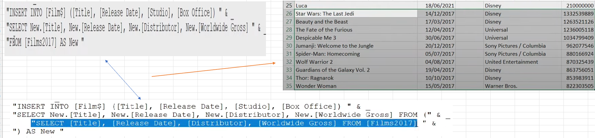
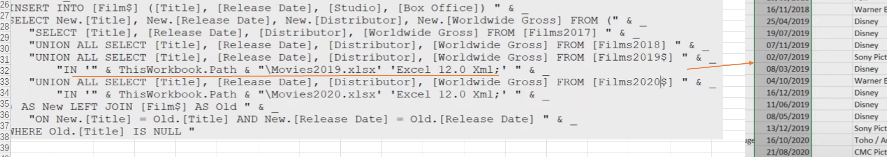

## Part 58.28 - SQL for Excel Files - Inserting Data into an Existing Sheet

- Inserting a Single Row 	(Connect *ThisWorkbook.Path & "\Movies.xlsx"*) 

  > "INSERT INTO [Film$] " & _
  >         "VALUES ('Luca', #18 Jun 2021#, 95, 'Disney', 210000000) "

- Deleting Rows from a Table

  > "DELETE FROM [Film$] WHERE [Title] = 'Luca' "     - - - - - > NOT SUPPORTED

- Choosing Which Columns to Populate 

  > "INSERT INTO [Film$] ([Title], [Release Date], [Studio], [Box Office]) " & _
  >         "VALUES ('Luca', #18 Jun 2021#, 'Disney', 210000000) "

  

- The Other worksheet Named FilmYears

  

  

- Inserting Data from a Different Worksheet

  

- Inserting Rows from Multiple Ranges or Sheets

  

- Avoiding Duplicates Using Joins

  > LEFT JOIN [Film$] AS Old " & _
  >             "ON New.[Title] = Old.[Title] AND New.[Release Date] = Old.[Release Date] " & _
  >         "WHERE Old.[Title] IS NULL 

- Inserting Data from Different Files

  

  

  > "UNION ALL SELECT [Title], [Release Date], [Distributor], [Worldwide Gross] FROM [Films2019] IN '" & ThisWorkbook.Path & "\Movies2019.xlsx'  'Excel 12.0 Xml;' "
