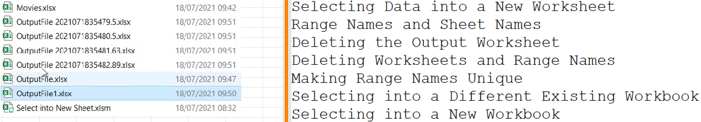
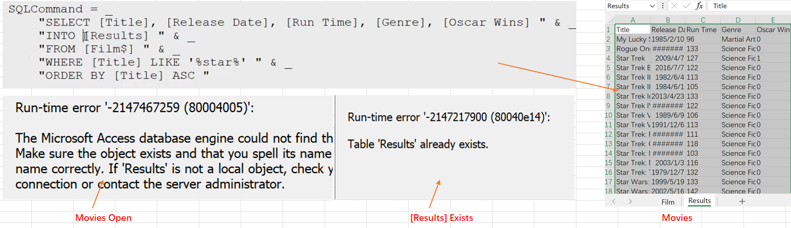
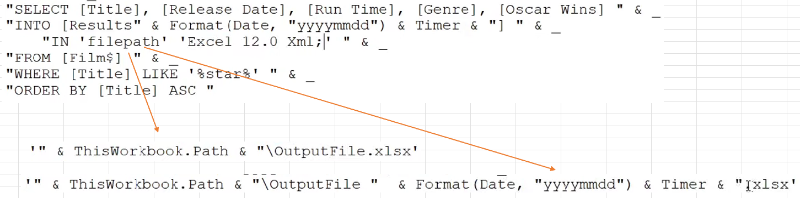

## Part 58.29 - SQL for Excel Files - Select Data into a New Sheet or Workbook

#### Selecting Data into a New Worksheet

> Movies Should Keep Closed & No Existing [Results] Table(RangeName) 
>
> better no duplicated worksheet names

> Deleting the Output Worksheet Can make work 

#### Deleting Worksheets and Range Names

> "DROP TABLE [Results]"  - - - > Just Clear the Contents of RangeNameCells, Name & Sheet still Exist

#### Making Range Names Unique

> . . . INTO [Results" & Format(Date, "yyyymmdd") & Timer & "] . . .

#### Selecting into a Different or new Workbook (Closed Require also)

#### 
