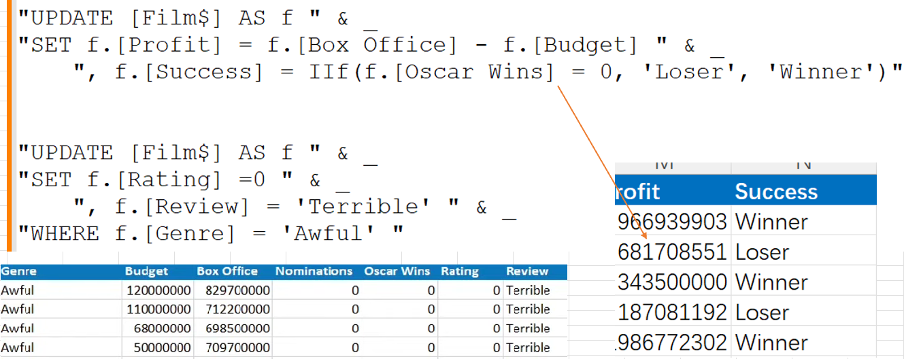
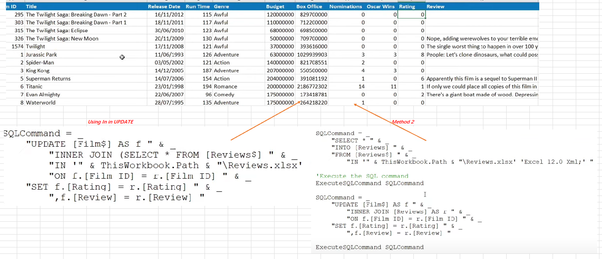

## Part 58.30 - SQL for Excel Files - Updating Existing Data

#### The Update Statement

> Connect ThisWorkbook.Path & "\Update\Movies.xlsx"
>
> "UPDATE [Film$] " & _
>         "SET [Rating] = 5, [Review] = '', [Last Updated] = now() "

#### Removing Values from a Column

> "UPDATE [Film$]  " & _
>         "SET [Rating] = Null, [Review] = Null, [Last Updated] = Null "
>
> Generate first Cell to track formatting

#### Tables with No Headers

#### Updating Criteria & Calculation

#### Updating from a Different Worksheet

> SQLCommand = _
>         "UPDATE [Film$] AS f " & _
>             "INNER JOIN [Reviews$] AS r " & _
>             "ON f.[Film ID] = r.[Film ID] " & _
>         "SET f.[Rating] =r.[Rating] " & _
>             ", f.[Review] = r.[Review] "

#### From a Separate Workbook

