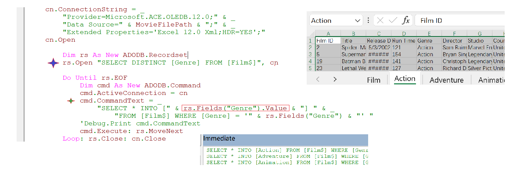
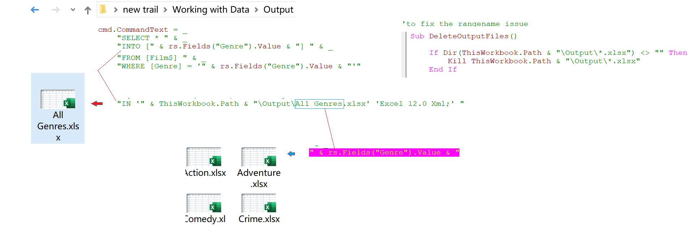
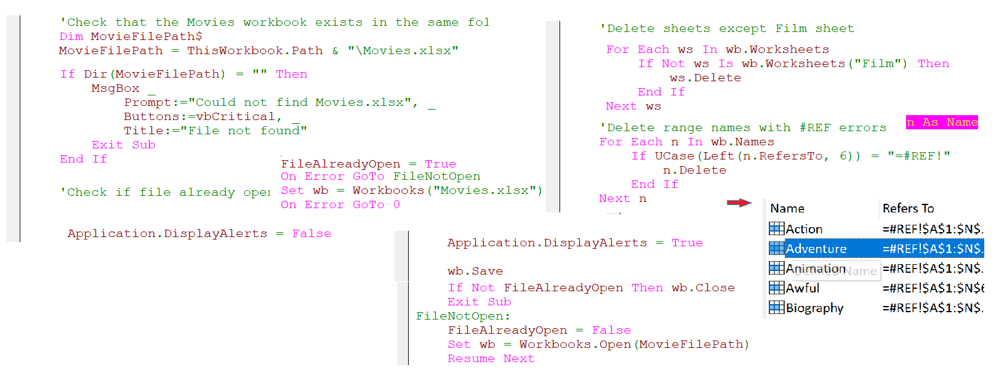

### Part 58.31 - SQL for Excel Files - Split a Table into Separate Sheets

- Split into the same workbook(source file need closed)

  

- Split into single or separate workbook

  
  
- delete range name to redo the split sub

  

