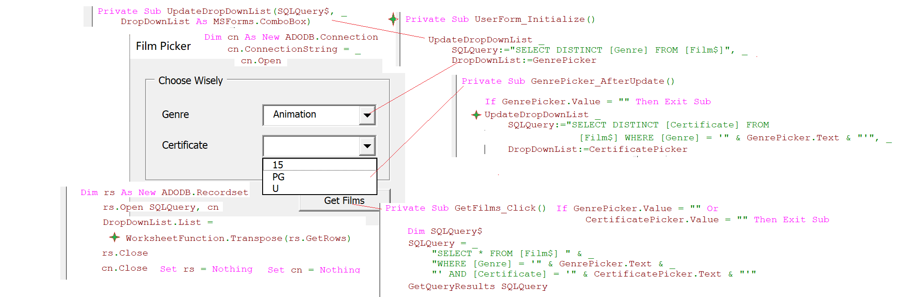

### Part 58.4 - SQL for Excel Files - Selecting All or Distinct Rows

#### Selecting Duplicate or Unique Rows

- Adding the All Keyword to a Query

  > "SELECT ALL [Title] FROM [Film$]"  =  "SELECT [Title] FROM [Film$]"

- Using the Distinct Keyword  

  > "SELECT DISTINCT [Title] FROM [Film$]" 	'asc sorted & unique

- Modifying the Sort Order

  > "SELECT DISTINCT [Genre] FROM [Film$] ORDER BY [Genre] DESC"

- Using Distinct with Multiple Columns

  > "SELECT DISTINCT [Genre], [Certificate] FROM [Film$]"
  >
  > "SELECT DISTINCT [Certificate], [Genre] FROM [Film$]"
  >
  > "SELECT DISTINCT [Certificate], [Genre] FROM [Film$] ORDER BY [Genre] ASC"

- Using Query Results to Provide Users with a Choice

  
