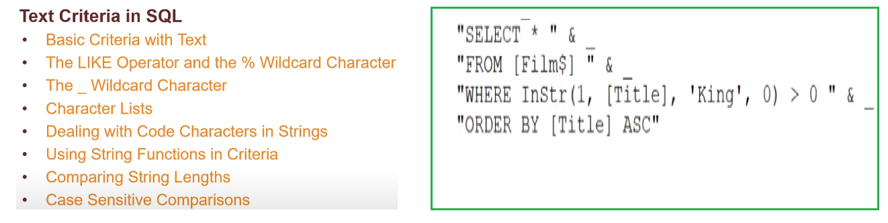
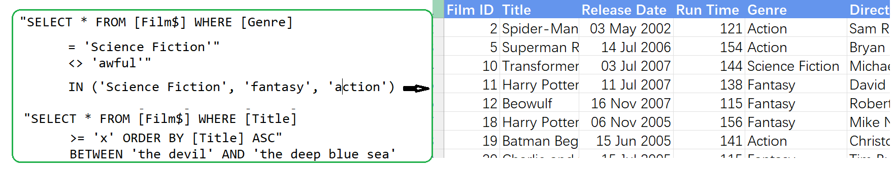
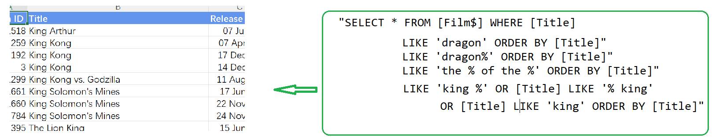
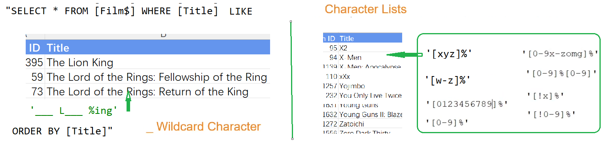
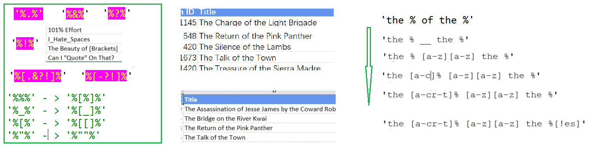
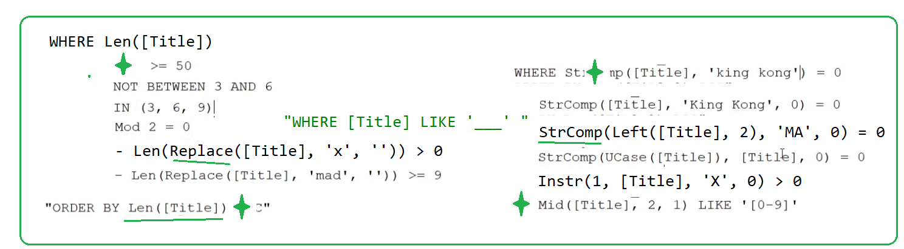

### Part 58.6 - SQL for Excel Files - Text Criteria and the Like Operator

#### Basic Criteria

#### The LIKE and % operator

#### _ and Character lists

#### Punctuation ,Exclamation Marks ...

#### Using Function in Criteria

