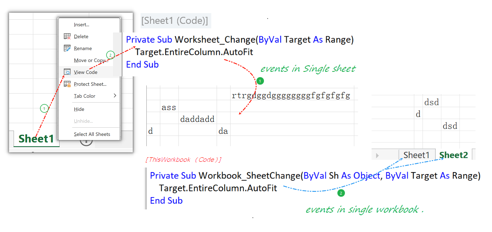
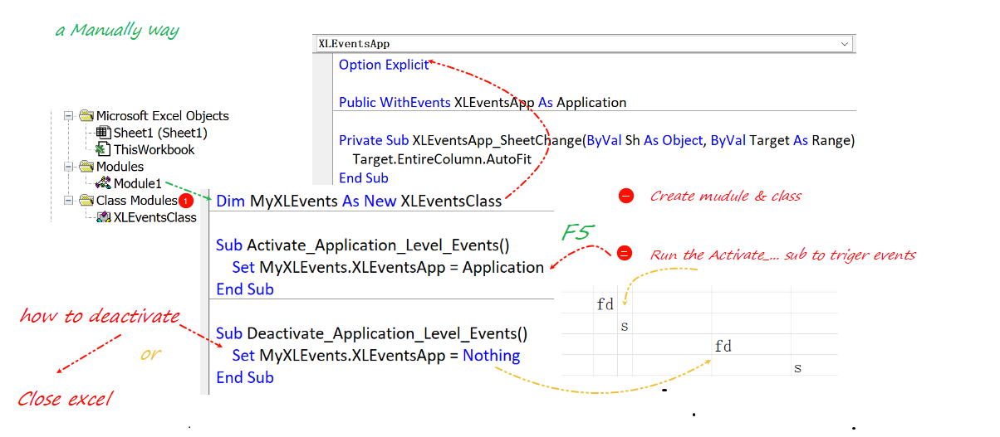
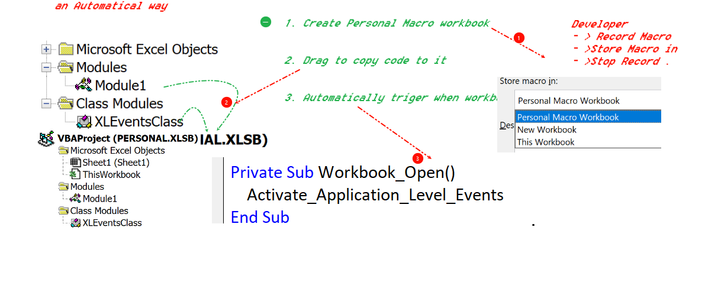

### How do I make a VBA event work in every workbook

- workbook and worksheet events(single sheet or workbook)

  

- make event work in multiple workbook (manually)

  
  
- Using Personal Macro workbook(automatically)

  