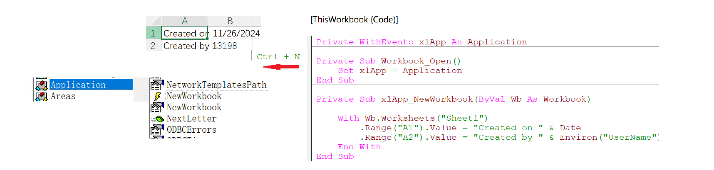
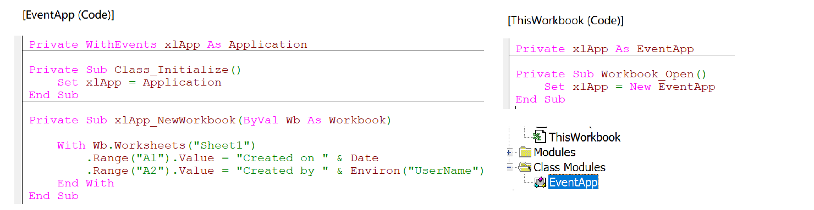

### Part 20.2 - Application Events

#### Workbook and Worksheet Events

#### Creating Application-Level Events

- Enabling App-Level events(Method 1)

  

- Using Class module to generate(Method 2)

  
