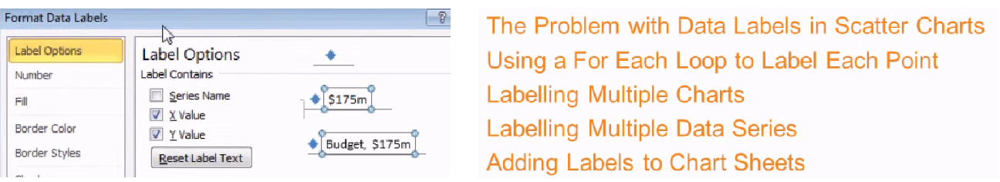
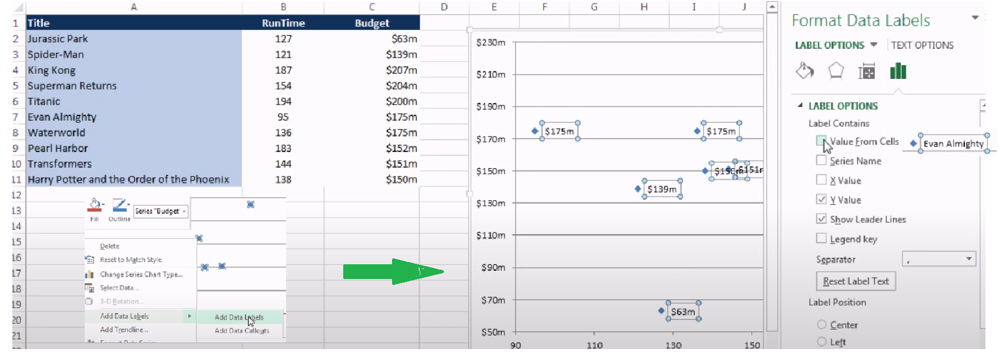
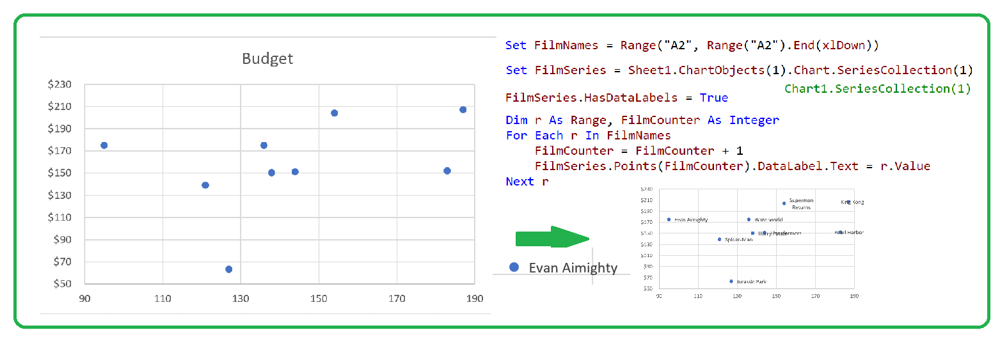
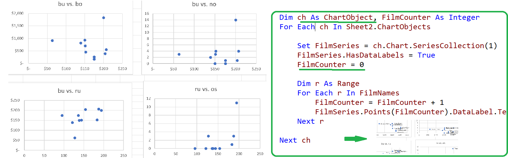
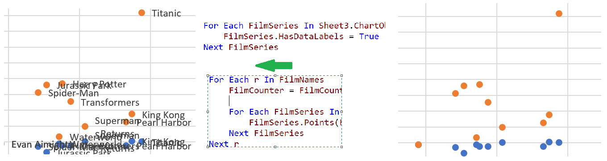
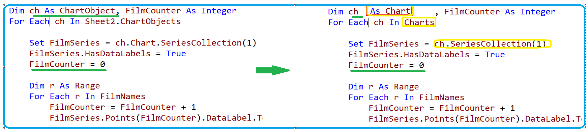

## Using Data Points on Scatter Charts

#### The Problem with Data Labels in Scatter Charts

- Version2010: 
  - Label Options is Shortly , has no *Value from Cells*

#### Using a For Each Loop to Label Each Point

#### Labelling Multiple Charts

#### Labelling Multiple Series

#### Labelling Multiple Chart Sheets

