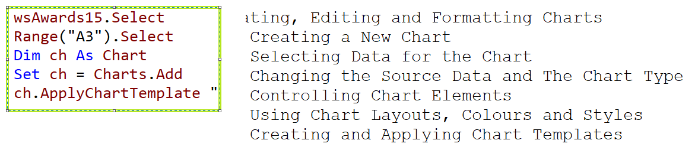

## Part 50.1 - Introduction to Charts in VBA

#### Creating a New Chart

- Creating basic Chart

  

#### Selecting Data for the Chart 

- Selecting all kinds of Data for populating

  

- Declaring Variabls to Loop Over a Range CreateOscarWinnerChart

  

#### Changing the Source Data and Chart Type

- Creating  &  Moving & Editing & Deleting

  
  

#### Controlling Chart Elements

- Edit the Chart element: ChartType, Legend, Axis, Datalables etc.

  

- Changing Layouts, Colors and Styles

  

- Applying Chart Templates   ***ch.ApplyChartTemplate "C:\ ....crtx"***
