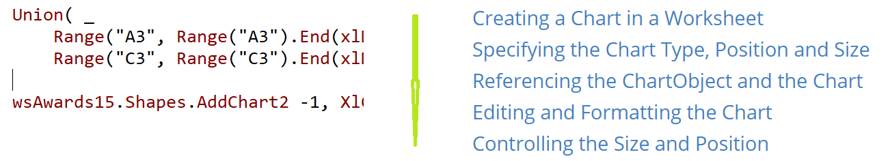
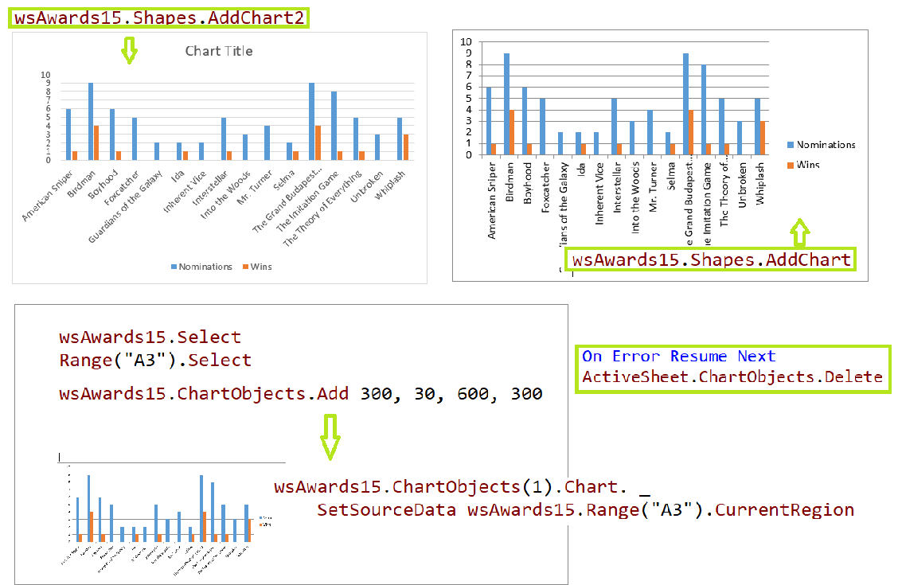
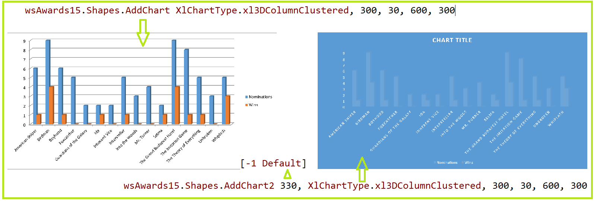
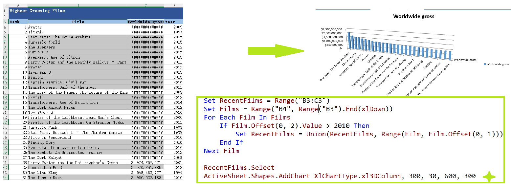
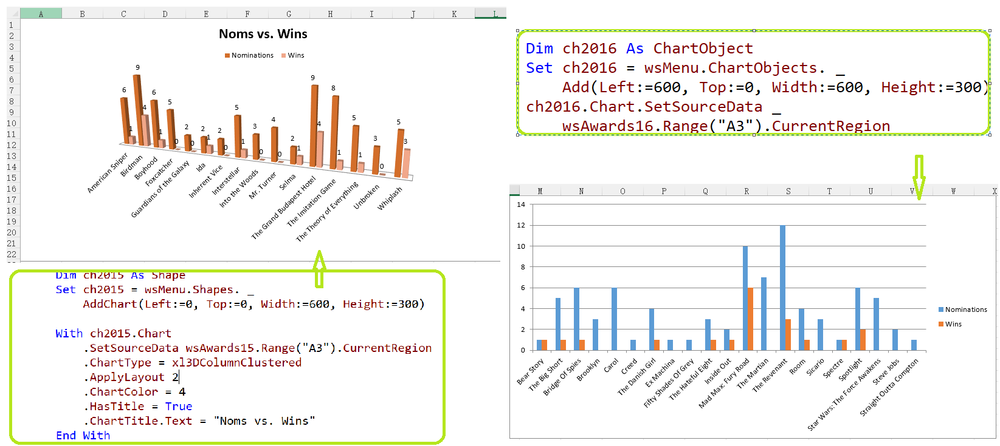
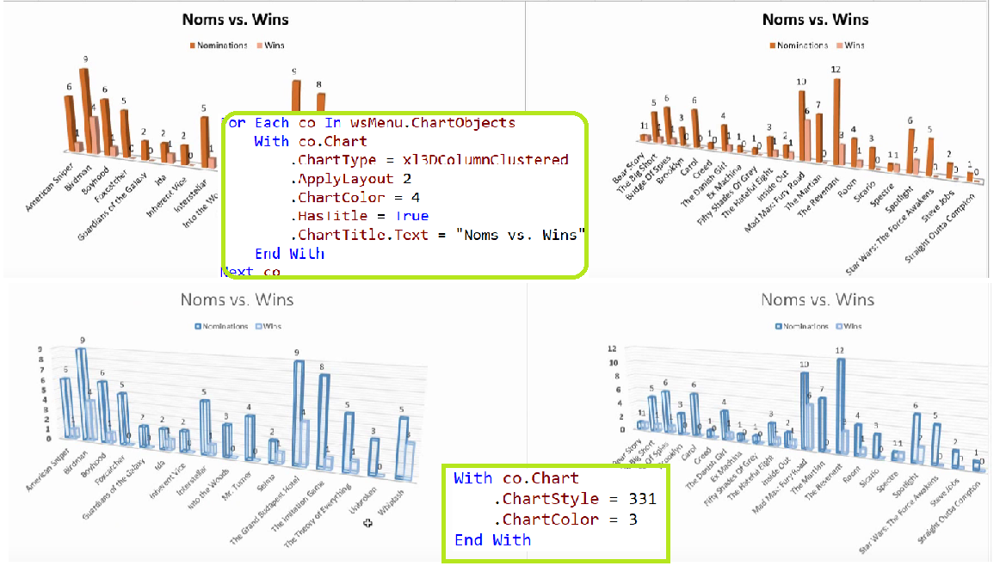
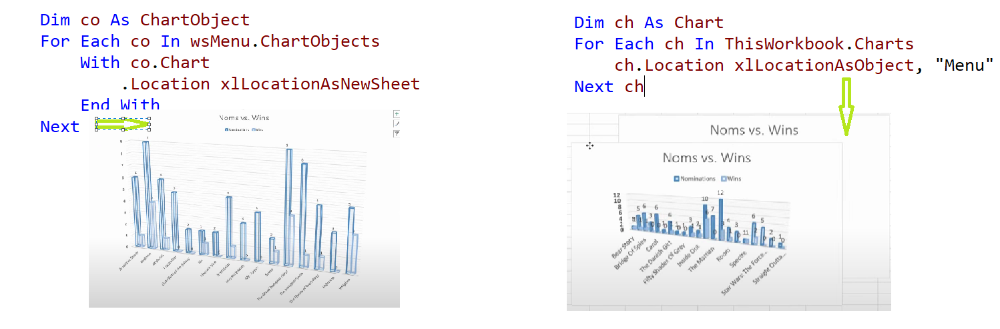
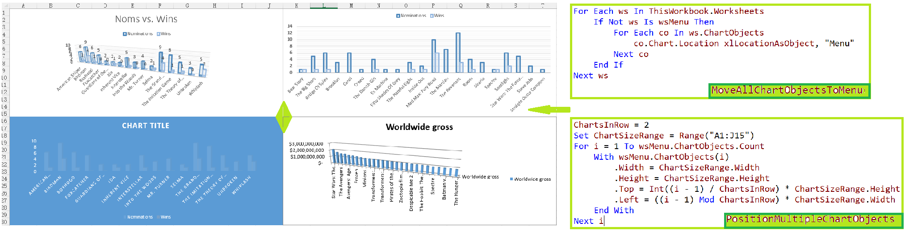

## Part 50.2 - Embedding Charts in Worksheets

#### Creating a Chart in a Worksheet

- Using the *AddChart*  *AddChart2* & *Add* Method

  

#### Specifying the Chart Type, Position and Size

- Specifying the Chart Type, Position and Size

  

  

- Selecting all kinds of Data for populating   . . . . .

- Selecting Chart Data Conditionally - - - > *ChartOfRecentFilms*

  

#### Referencing the ChartObject and the Chart

- Creating Multiple ChartObjects

  

#### Editing and Formatting the Chart

- Looping Over *ChartObjects*

  

- Converting *ChartObject* -- > *Chart* 

  

- Converting Chart Sheets to ChartObjects

#### Controlling the Size and Position

- Positioning and Sizing a ChartObject Based on a Range

  > co.Left = Range("A3").End(xlToRight).Offset(0, 2).Left
  > co.Top = Films.Top

  > co.Height = Films.Height
  > co.Width = Films.Width * 3

- Move & Position Multiple Charts to One Sheet

  

  