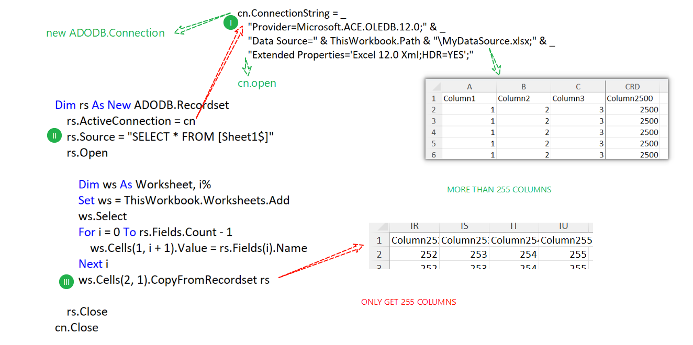
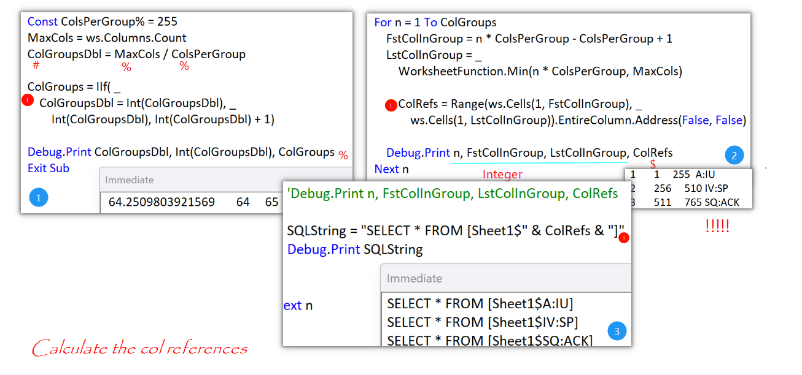
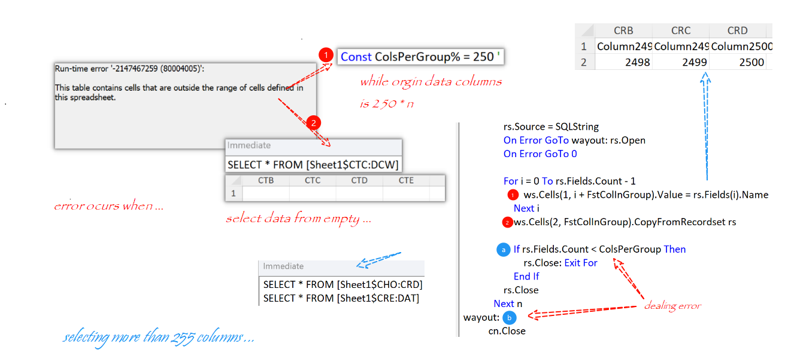
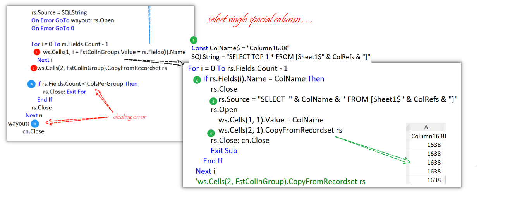

### Part 34 - Type Declarations

- #### the 255 column limit

  

- #### The Approach to Solving the problem

  - Calculating the Column References

    

  - Selecting more than 255 Columns

    

  - Selecting a Single Specific Column:  'Column1638' .etc

    
