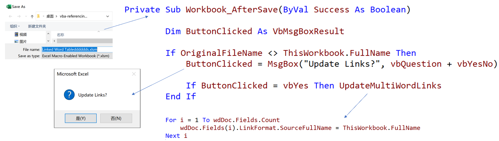

### How do I Add Videos to PowerPoint Slides with VBA?

- #### Add online or local picture to slide

  

- #### Add Videos to slide

  

- Creating Sample Data

  

  > [A1:C5]=RANDBETWEEN(1,100)

- Creating a Word Doc

  > Dim wdApp As New Word.Application

#### Pasting Linked Excel Data

- Using the Paste Excel Table Method

  > wdApp.Selection.PasteExcelTable True, False, False

- Checking The Document are Linked (F9 to refresh..)

  

- Saving a Linked Doc

  > wdApp.ActiveDocument.SaveAs2 _
  >         ThisWorkbook.Path & "\Test\Linked Doc.docx"

#### Changing the Link Source

- Viewing Links in the Word Document

  

- Changing the Linked Files Source & Write Code to Refresh

  

#### Creating and Updating Multiple Linked Tables

- Create Multi Linked Table

  

- Update Multi Word Links

  > Dim i As Integer
  >     For i = 1 To wdDoc.Fields.Count
  >         wdDoc.Fields(i).LinkFormat.SourceFullName = ThisWorkbook.FullName
  >     Next i

#### Changing the Link Source using the Save Events

- Workbook_BeforeSave (*Click Save*)

  

- Workbook_AfterSave(*F12*)

  