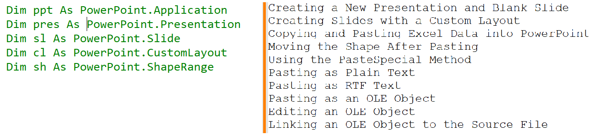
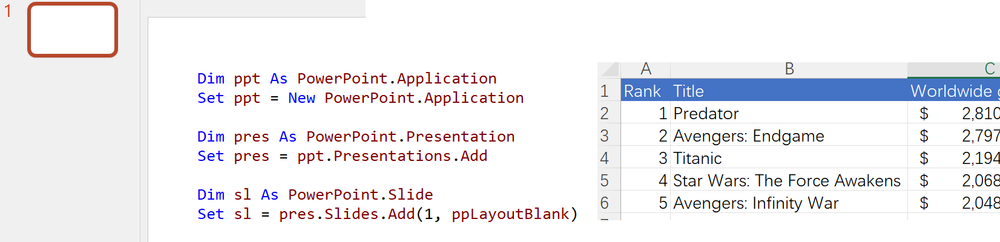
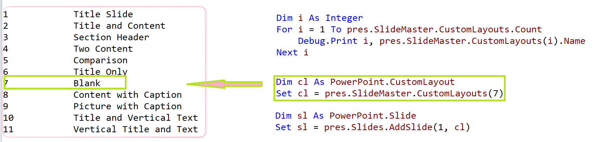
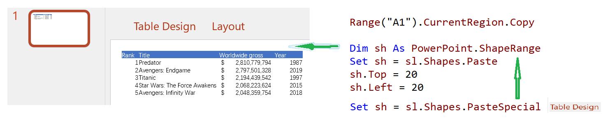
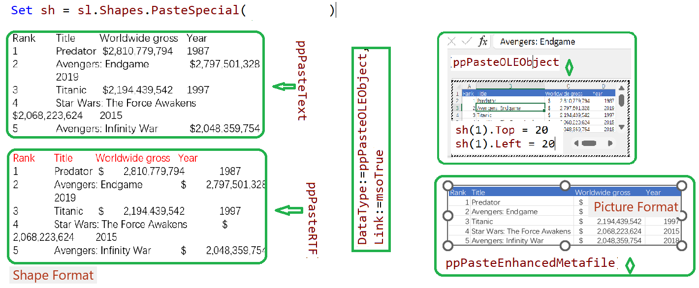

## How do I copy Excel data into PowerPoint using VBA

#### CopyDataIntoPowerpoint

- Creating a New Presentation  &  Creating a  Blank Slide

  
  
- Creating Slides with a Custom Layout 

  
  
- Copying and Pasting Excel Data into PowerPoint 
   

- Using the PasteSpecial Method

  

  > Set sh = sl.Shapes.PasteSpecial(DataType:=ppPasteOLEObject, Link:=msoTrue)

​	

