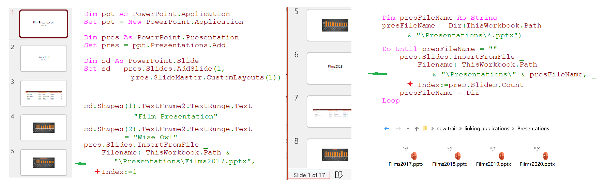
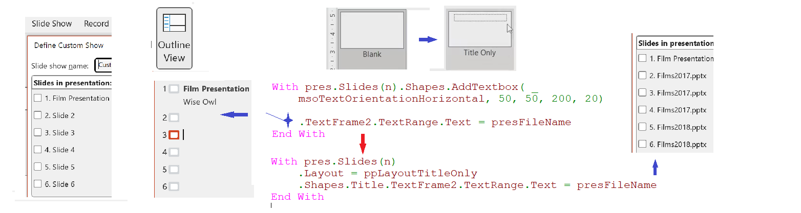

### How do I copy slides from multiple PowerPoint files into one presentation

#### Insert Slides from a File or  multiple

- Add a textbox to Each Slide(cons Outline view & Slide Show)

  
  
- Adding a Title Placeholder(to fix outline view or slide show)

  

​	

