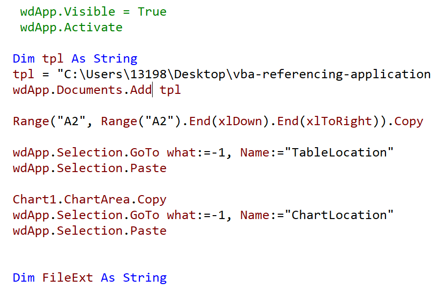

### Part 27.1 - Creating Word Documents

#### Writing Text & Copying Data  into Word

#### Save and Close Document

- Saving a Word Document

  > wdApp.ActiveDocument.SaveAs2 ...

- Closing Documents and Quitting Word

  > wdApp.ActiveDocument.Close
  >
  > wdApp.Quit
  >
  > set wdApp=Nothing

#### Using Version-Specific Methods

#### Using Template

- Creating a Word Template
  1. Insert -> Links -> Bookmarts : *TableLocation*
  2. Ctrl + Enter : Generate new page
  3. Insert -> Links -> Bookmarts : *ChartLocation*
  4. Saveas Word Template(*.dotx) : Movie Report Template

  
  
- Creating Documents from Templates

- Going to a Bookmark

  `wdApp.Selection.GoTo what:=-1, Name:="TableLocation"`

- Using Template to Create report

  

  