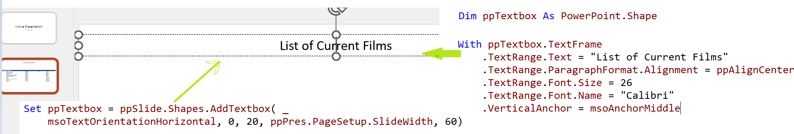

### Cart 28.1 - Creating PowerPoint Presentations

[TOC]

#### Creating Presentations and Slides

- Creating Presentations

  

  > Dim ppPres As PowerPoint.Presentation
  >     Set ppPres = ppApp.Presentations.Add
  
- Creating a Title Slide

  
  
- Adding Text to Textboxes

  
  
  *.TextRange.Text*

#### Copying Tables into PowerPoint

- Copying an Excel Range into PowerPoint

  

  > ppSlide.Shapes.PasteSpecial ppPasteOLEObject

- Adding a Custom Textbox and Formatting

  

  

#### Copying an Excel Chart into Power Point

#### Applying a Template  or Theme to a Presentation

#### Saving and Closing a Presentation & Late binding

