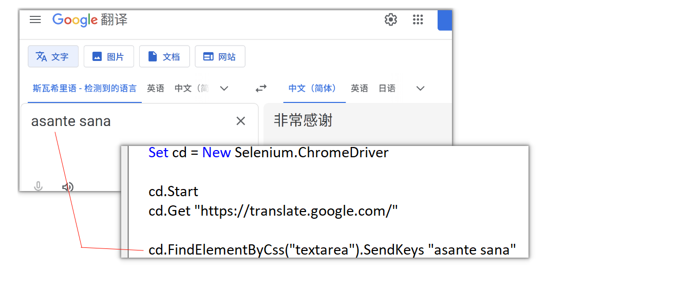
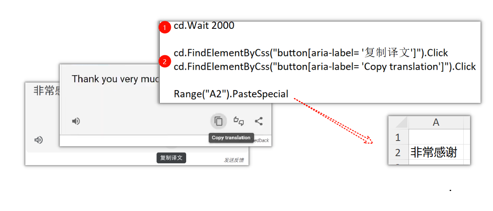
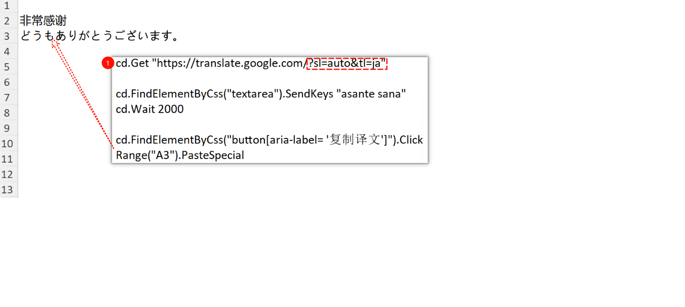
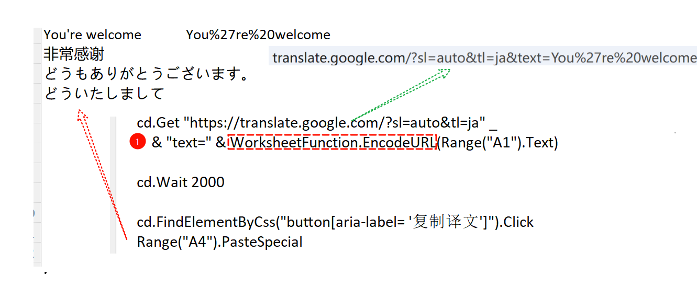

### **How do I use Google Translate with Excel VBA**

#### Entering Text to be Translated

#### Extracting the Translated Text

#### Changing the Language Used

#### Setting the Text in the Query String

