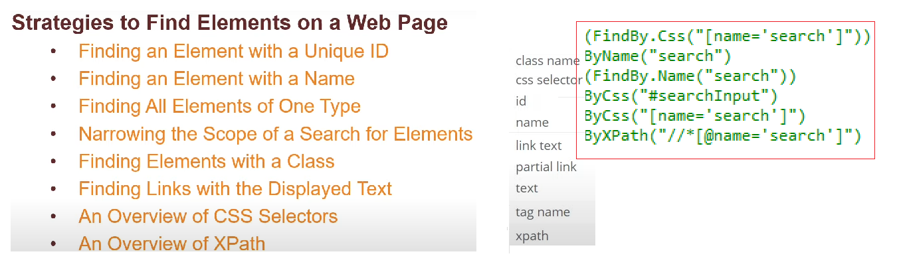
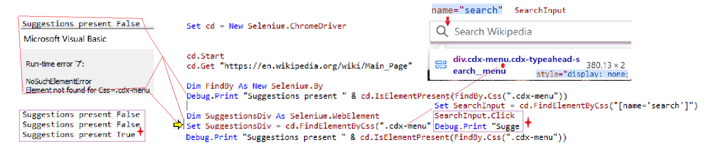
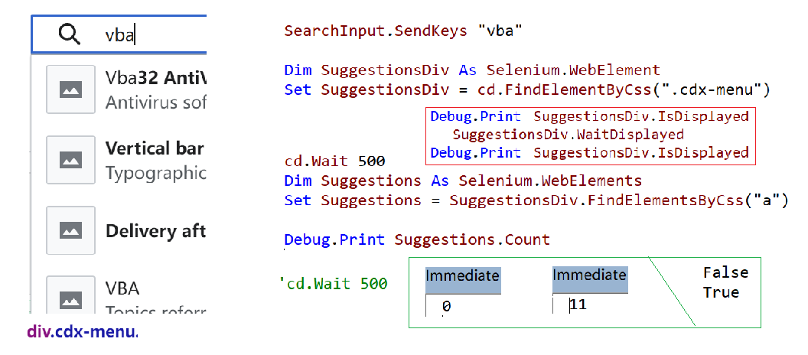

### **How do I use Google Translate with Excel VBA**

#### Finding an Element by ID ...

#### Finding Elements by Tag

#### Narrowing the Scope & Further

#### Finding Elements by Class or Link text

#### Finding Elements by Css or xPath

