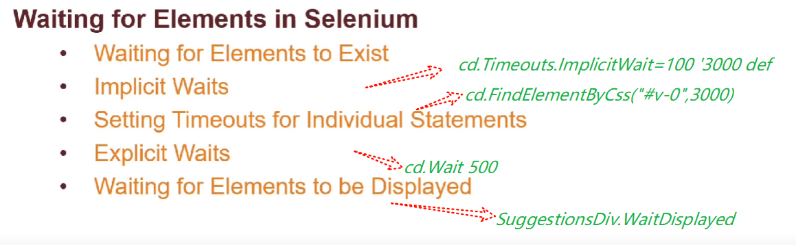
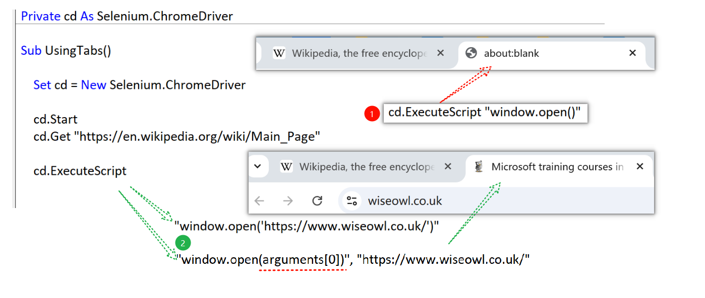
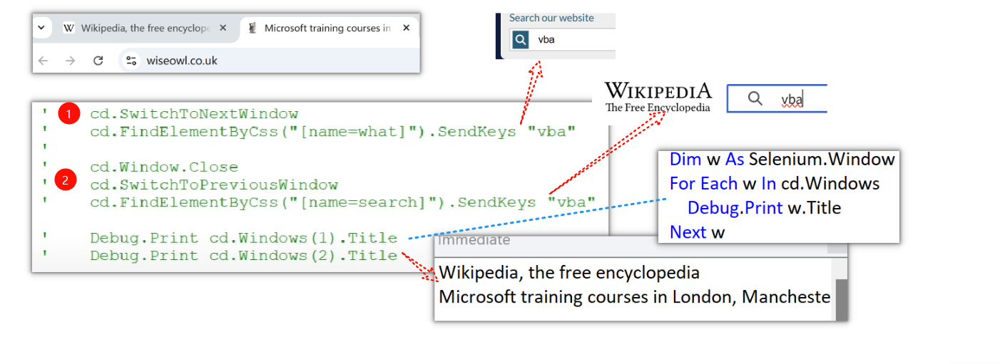
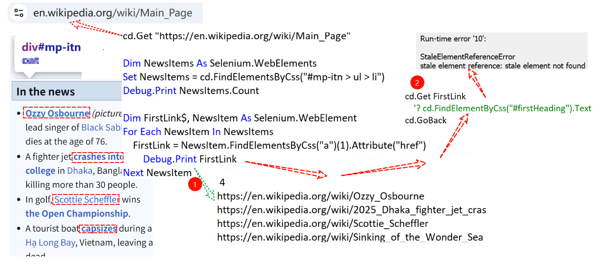
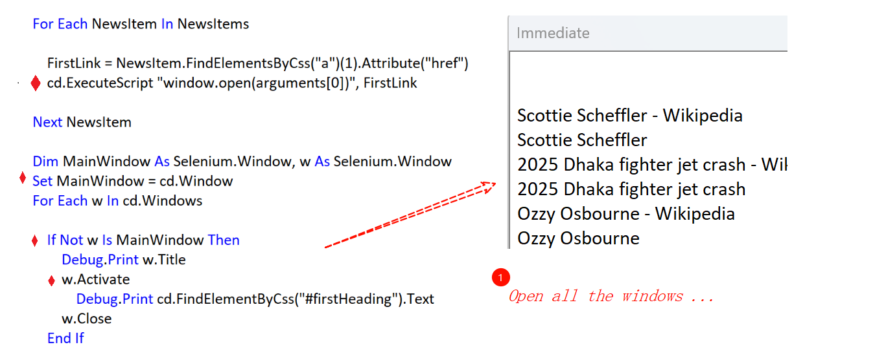
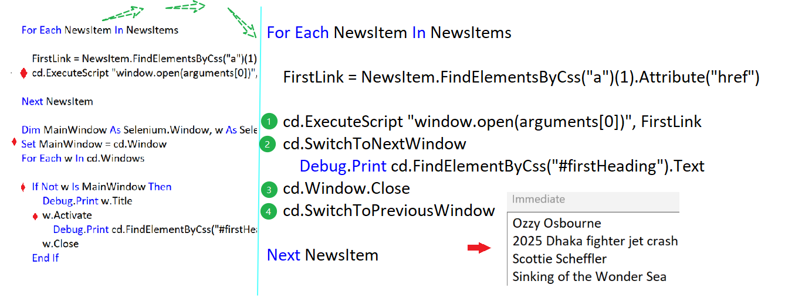

### Part 57.6 - Working with Multiple Tabs in Selenium

#### Open a new tab and navigating a url

#### Switch between  & windows

#### A practical example for Wikipedia

- The Stale Element Reference Errors

  

- Opening Multiple Tabs and Looping Through Them

  

- Opening One Window at a Time

  

- af

#### Loop through the suggestions

