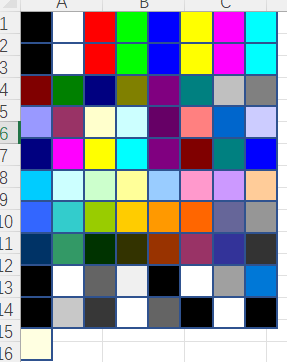
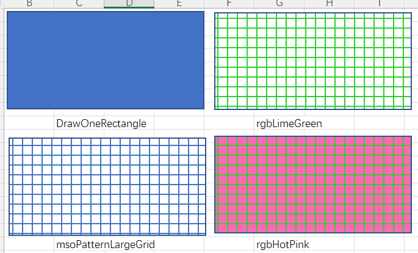

# Part 52.2 - Formatting Shapes

[TOC]

## Formatting Shapes in VBA

- Set up

- Changing Fill Colors

  > s.Fill.ForeColor.RGB = 56342	 '0-16777215 (256^3-1)

- RGB, Theme Colors and Scheme Colors

  - Using RGB Colors

    - vbconstants

      > s.Fill.ForeColor.RGB = vbRed

    - color constants

      >  s.Fill.ForeColor.RGB = ColorConstants.vbMagenta

    - rgb constants

      > s.Fill.ForeColor.RGB = XlRgbColor.rgbMistyRose

    - rgb function [NHS Identity Guidelines | Colours (england.nhs.uk)](https://www.england.nhs.uk/nhsidentity/identity-guidelines/colours/)

      > s.Fill.ForeColor.RGB = RGB(0, 94, 184)
      >
      > ?rgbMistyRose -> 14804223 
      >
      > 

    - Creating Custom Enumerations(NHS)

      > ?RGB(0, 94, 184) -> 12082688 
      >
      > Public Enum NHSColours
      >     NHSBlue = 12082688
      > End Enum
      >
      > s.Fill.ForeColor.RGB = NHSBlue

  - Using Theme Colors

    - theme Color

      > s.Fill.ForeColor.ObjectThemeColor = msoThemeColorAccent3

    - Changing the Document Theme: Will Change Color and fonts and others...

      > ThisWorkbook.ApplyTheme "C:\Program Files (x86)\Microsoft Office\root\Document Themes 16\Ion.thmx"
      >
      > ThisWorkbook.ApplyTheme "C:\Program Files (x86)\Microsoft Office\root\Document Themes 16\Office Theme.thmx"

    - Changing Theme Colors

      > ThisWorkbook.Theme.ThemeColorScheme.Load _
      >         "C:\Program Files (x86)\Microsoft Office\root\Document Themes 16\Theme Colors\Red.xml"

  - Using Scheme Colors

    - Changing Scheme Colors

      > s.Fill.ForeColor.SchemeColor = 42

    - Listing Scheme Colors

      

      

      > sWidth = 20 : sHeight  = 20 : sCols = 8
      >
      > Dim s As Shape
      >     For i = 0 To 80
      >         x = ((i Mod sCols) * sWidth)
      >         y = Int(i / sCols) * sHeight
      >         Set s = Sheet1.Shapes.AddShape(msoShapeRectangle, x, y, sWidth, sHeight)
      >     s.Fill.ForeColor.SchemeColor = i
      > Next i

- Removing Fill Colors

  > s.Fill.Visible = msoFalse

- Changing the Brightness (-1 to 1)

  > s.Fill.ForeColor.Brightness = -1

- Tints and Shades

  > s.Fill.ForeColor.TintAndShade = -0.5

- Patterns and Color Gradients

- Changing back color directly is of no effect

  > s.Fill.BackColor.RGB = rgbHotPink

- Changing the Patterns

  

  >  With s.Fill
  >
  > ​    .Patterned msoPatternLargeGrid
  > ​    .ForeColor.RGB = rgbLimeGreen
  > ​    .BackColor.RGB = rgbHotPink
  >
  > End With

- Formatting Lines
- Glow, Reflection, Shadow and Soft Edges
- Basic 3-D Effects
- Copying Formats and Setting Defaults  
