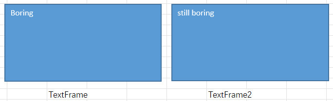
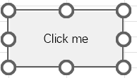
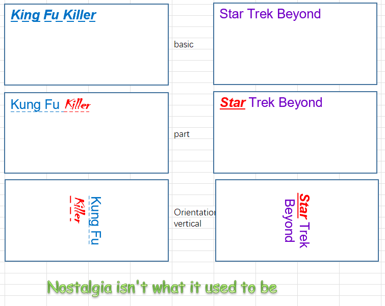
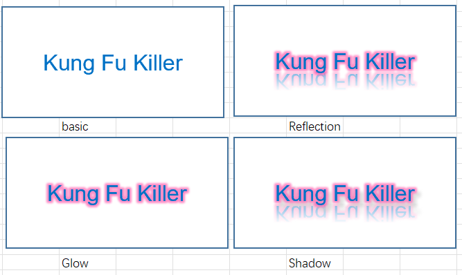

# Part 52.3 - Adding Text to Shapes

[TOC]

## Working with Shape Text

- Set up an example

  - deleteExisting

    > Sheet1.Shapes.SelectAll
    >     Selection.Delete

  - add a shape

    > Set s = Sheet1.Shapes.AddShape(msoShapeRectangle, 20, 20, 200, 100)

- Adding Basic Text to a Shape

  

  - TextFrame 

    > s.TextFrame.Characters.Text = "Boring"

  - TextFrame2 

    > s.TextFrame2.TextRange.Text = "still boring"

- TextFrame and TextFrame2 Objects are not all the same

  

  -----err when add form control use textframe2 ---

  > Set s = Sheet1.Shapes.AddFormControl(xlButtonControl, 20, 20, 100, 50)
  >
  > s.TextFrame.Characters.Text = "Click me"
  >     s.TextFrame2.TextRange.Text = "Click me 2" ERROR!

- Text Boxes, Labels and WordArt

  

  - Text Boxes

    > Set s = Sheet1.Shapes.AddTextbox(msoTextOrientationDownward, 20, 20, 200, 100)
    >
    > s.TextFrame.Characters.Text = "Boring"...

  - Labels

    > Set s = Sheet1.Shapes.AddLabel(msoTextOrientationUpward, 20, 20, 200, 100)
    >
    > s.TextFrame.Characters.Text = "Boring"...

  - WordArt

- Formatting Text

  - The Preparing

    > Set s = Sheet1.Shapes.AddShape(msoShapeRectangle, 20, 20, 200, 100)
    >     s.Fill.ForeColor.RGB = rgbWhite

  - Basic text Font Formatting

    - In a TextFrame2

      > With s.TextFrame2.TextRange.Font
      >         .Fill.ForeColor.RGB = RGB(0, 114, 198)
      >         .Size = 16
      >         .Name = "Arial"
      >         .UnderlineStyle = msoUnderlineDashLongLine
      >     End With

    - In  a TextFrame

      > With s.TextFrame.Characters.Font
      >         .Color = RGB(114, 0, 198)
      >         .Size = 16
      >         .Name = "Arial"
      >     End With

  - Formatting Part of Text 

    - In a TextFrame2

      > With s.TextFrame2.TextRange.Characters(9, 6).Font
      >         .Fill.ForeColor.RGB = rgbRed
      >         .Bold = msoCTrue
      >         .Italic = msoCTrue
      >         .Size = 20
      >         .Name = "Chiller"
      >     End With

    - In  a TextFrame

      > With s.TextFrame.Characters(1, 4).Font
      >         .Color = rgbRed
      >         .Bold = msoCTrue
      >         .Italic = msoCTrue
      >         .Underline = XlUnderlineStyle.xlUnderlineStyleSingle
      >     End With

  - Text Orientation and Alignment

    - In a TextFrame2

      > With s.TextFrame2
      >         .Orientation = msoTextOrientationDownward
      >         .HorizontalAnchor = msoAnchorCenter
      >         .VerticalAnchor = msoAnchorMiddle
      >     End With

    - In  a TextFrame

      > With s.TextFrame
      >         .Orientation = msoTextOrientationDownward
      >         .HorizontalAlignment = xlHAlignCenter
      >         .VerticalAlignment = xlVAlignCenter
      >     End With

- Glow, Reflection and Shadow Effects frame2 only

    

      With s.TextFrame2.TextRange.Font
              .Fill.ForeColor.RGB = RGB(0, 114, 198)
              .Size = 20
              .Name = "Arial"
      	With .Glow
              .Color.RGB = rgbHotPink
              .Radius = 10
              .Transparency = 0.25
          End With
          
          .Reflection.Type = msoReflectionType9
          
          With .Shadow
              '.Type = msoShadow20
              .Style = msoShadowStyleOuterShadow
              .Blur = 5
              .Transparency = 0.25
              .OffsetX = 10
              .OffsetY = 10
              .ForeColor.RGB = rgbLightGray
          End With
      End With
      
      With s.TextFrame2
          .HorizontalAnchor = msoAnchorCenter
          .VerticalAnchor = msoAnchorMiddle
      End With

  

  

