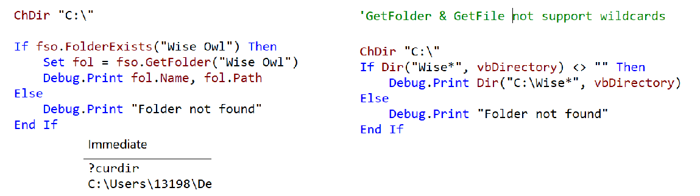
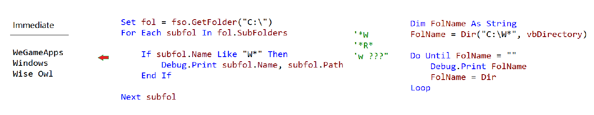
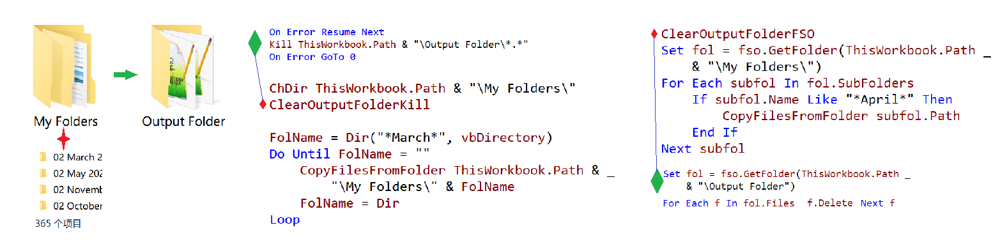

### How do I find a folder with a partial name in VBA

- #### Testing if a Folder Has Been Found

  

- ####  Looping Through Folders using  fso & dir

  

- #### Coping files from special folders

  

