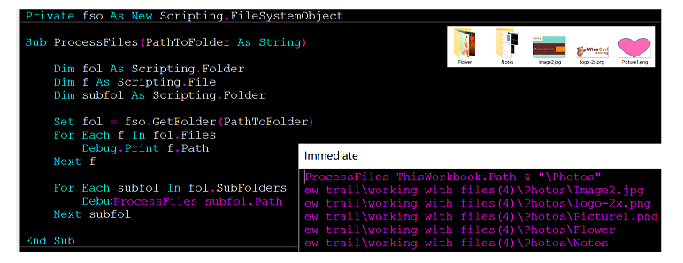
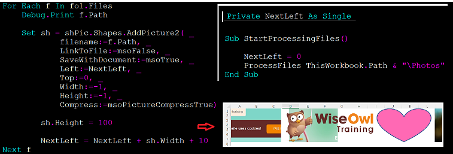
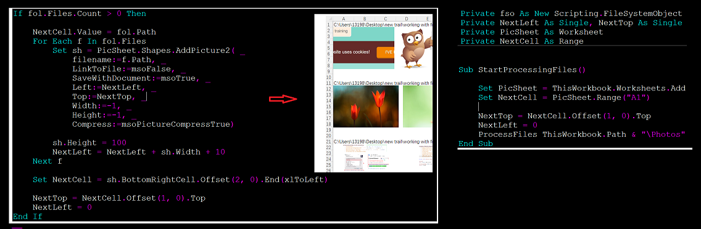

### How do I loop through folders and subfolders

- ####  Recursive Looping Through Files in a Folder

  

- ####  Inserting and resizing a pic . in one row

  

- #### Inserting and resizing a pic . by diff rows

  

